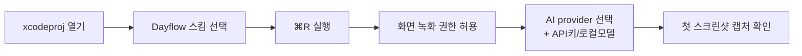

# 00. 시작하기

> **이 문서에서 다루는 것**: Dayflow가 어떤 앱인지, 데이터가 어디 저장되는지, 그리고
> 내 Mac에서 빌드해서 실행하는 첫 걸음(권한·API키 포함).
>
> **선행 지식**: 없음. 여기서 시작하세요.

---

## 1. Dayflow는 무슨 앱인가

Dayflow는 **"내가 Mac에서 한 일을 자동으로 기록해주는 일기장"**입니다. 타이머를 켜거나
메모를 적지 않아도, 화면을 들여다보고 AI가 알아서 "오전 10시~11시: 결제 모듈 디버깅"
같은 타임라인을 만들어줍니다.

핵심 가치 4가지:
- **자동 타임라인**: 화면 활동 → 시간대별 활동 카드
- **일일 스탠드업**: 어제 한 일 / 오늘 할 일 / 블로커 자동 정리
- **주간 리뷰**: 집중 시간, 앱 사용량, 딴짓 분석
- **채팅**: "어제 회의 몇 시간 했지?"를 자연어로 질문

**프라이버시 우선**: 오픈소스이고, 모든 데이터는 로컬에만 저장됩니다. AI도 Ollama 같은
로컬 모델로 돌리면 인터넷에 아무것도 안 나갑니다.

---

## 2. 데이터는 어디 저장되나

```
~/Library/Application Support/Dayflow/
├── chunks.sqlite          # 메인 DB (스크린샷 메타·배치·observation·카드 전부)
├── chunks.sqlite-wal      # WAL 로그 (→ 04편 참고)
├── chunks.sqlite-shm      # WAL 공유 메모리
└── recordings/            # 실제 스크린샷 JPG 파일들 (YYYYMMDD_HHmmssSSS.jpg)
```

> 💡 **WAL이 뭐야?** Write-Ahead Logging. SQLite가 빠르게 쓰기 위해 변경분을 별도 로그에
> 먼저 쌓는 방식. 자세한 건 [용어집](glossary.md)과 [04편](04-storage-grdb.md).

DB를 직접 들여다보고 싶으면:
```bash
sqlite3 ~/Library/Application\ Support/Dayflow/chunks.sqlite ".tables"
```

> ⚠️ 앱이 켜져 있으면 DB가 잠겨 있을 수 있습니다. 읽기 전용으로 열거나 앱을 잠시 끄세요.

---

## 3. 프로젝트 구조 (최상위)

```
Dayflow/                       # 저장소 루트
├── Dayflow/                   # Xcode 프로젝트 폴더
│   ├── Dayflow.xcodeproj      # ← Xcode로 이걸 연다
│   └── Dayflow/               # 실제 소스 코드 (App, Core, Views, System...)
├── DayflowTests/              # 테스트
├── scripts/                   # 릴리스 자동화 스크립트 (→ 09편)
├── docs/                      # README용 이미지, appcast.xml
└── HANDOFF/                   # ← 지금 읽는 이 문서들
```

소스 코드 폴더 상세는 [01편 아키텍처](01-architecture.md)에서.

---

## 4. 로컬 빌드 & 실행 가이드

### 4-1. 준비물
- **macOS 14.0 이상** (개발 머신)
- **Xcode 16+** (Swift 6 / SwiftUI 빌드용)
- Apple 개발자 계정은 **로컬 실행에는 불필요** (서명만 자동). 릴리스엔 필요(→ 09편).

### 4-2. 빌드 단계



1. **프로젝트 열기**
   ```bash
   open Dayflow/Dayflow.xcodeproj
   ```
2. **스킴 선택**: 상단 툴바에서 `Dayflow` 스킴 + `My Mac` 타겟.
3. **실행**: `⌘R`. 첫 실행이면 [온보딩 플로우](08-onboarding-access.md)가 뜸.

### 4-3. 화면 녹화 권한 (필수)
Dayflow는 화면을 캡처하므로 권한이 꼭 필요합니다.

- **시스템 설정 → 개인정보 보호 및 보안 → 화면 기록 및 시스템 오디오** → Dayflow 체크
- 권한을 처음 주면 **앱 재시작**이 필요할 수 있음(macOS 특성).
- 코드상 권한 확인은 [Core/Access/](../Dayflow/Dayflow/Core/Access/), 요청 UI는
  [ScreenRecordingPermissionView.swift](../Dayflow/Dayflow/Views/Onboarding/ScreenRecordingPermissionView.swift).

### 4-4. AI provider 셋업
온보딩에서 4가지 중 하나를 고릅니다(자세히는 [05편](05-ai-llm.md)):

| Provider | 셋업 방법 | 인터넷 |
|----------|-----------|--------|
| **Gemini** | Google AI Studio에서 API 키 발급 → 입력 | 필요 |
| **Dayflow Backend** | Dayflow 계정 로그인(토큰) | 필요 |
| **Ollama** | `ollama serve` 로컬 실행 후 모델 지정 | 불필요 |
| **Chat CLI** | 터미널에 claude/codex CLI 설치 | CLI에 따름 |

> 개발 중 가장 빠른 검증: **Gemini API 키** 하나 받아서 넣는 것.

### 4-5. 첫 캡처 확인
실행 후 10초쯤 지나면 `~/Library/Application Support/Dayflow/recordings/`에
JPG가 쌓이기 시작합니다. 안 쌓이면 → [10편 트러블슈팅](10-recipes-faq.md) "녹화 안 됨".

---

## 5. 앱 진입점 (코드 첫 발자국)

| 파일 | 역할 |
|------|------|
| [App/DayflowApp.swift](../Dayflow/Dayflow/App/DayflowApp.swift) | SwiftUI `@main` 진입점. 메인 윈도우 정의, 온보딩 vs 메인 분기 |
| [App/AppDelegate.swift](../Dayflow/Dayflow/App/AppDelegate.swift) | 앱 라이프사이클. 녹화 시작, 분석/크래시 추적 설정, 마이그레이션 |
| [App/AppState.swift](../Dayflow/Dayflow/App/AppState.swift) | `@MainActor` 전역 상태. 녹화 토글, 현재 탭 등 |

이 셋만 열어보면 "앱이 켜질 때 무슨 일이 일어나는지"가 보입니다. 흐름은 다음 편에서.

---

## 다음 편 예고
👉 [01. 아키텍처 큰 그림](01-architecture.md) — 폴더 구조와 레이어가 어떻게 나뉘는지,
모듈들이 서로 어떻게 의존하는지 지도를 그립니다.
