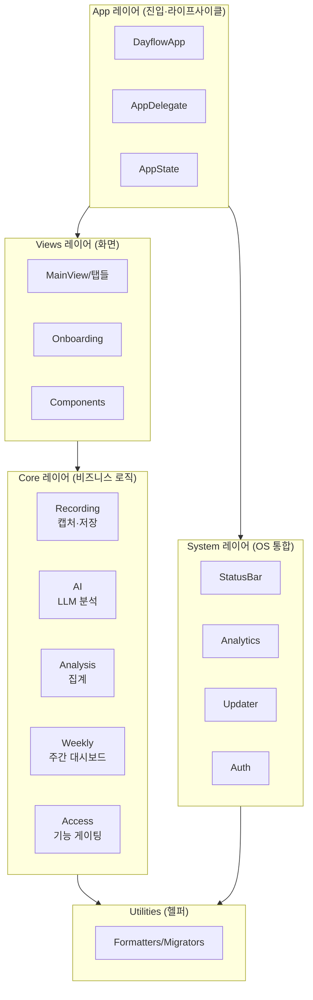
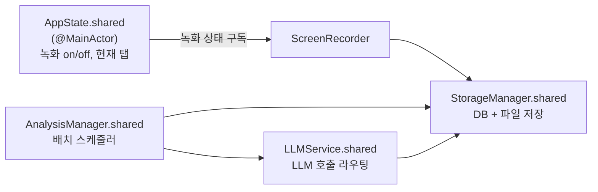
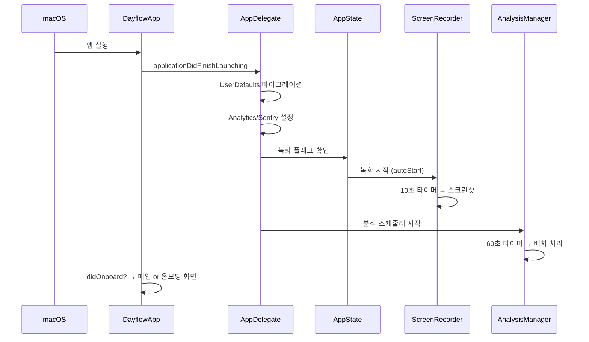

# 01. 아키텍처 큰 그림

> **이 문서에서 다루는 것**: Dayflow 코드가 어떤 레이어로 나뉘고, 폴더가 어떻게 구성되며,
> 핵심 싱글톤(전역 객체)들이 누구인지. 세부 구현 전에 "지도"를 먼저 봅니다.
>
> **선행 지식**: [00. 시작하기](00-getting-started.md)

---

## 1. 레이어 한 장 요약

Dayflow는 위에서 아래로 **단방향 의존**하는 4.5개 레이어입니다.



> 핵심 원칙: **Views는 Core를 부르지만 Core는 Views를 모른다.** 그래서 로직(Core)을
> UI(Views) 없이도 테스트·재사용할 수 있습니다.

---

## 2. 폴더 구조 (소스 루트: `Dayflow/Dayflow/`)

```
Dayflow/Dayflow/
├── App/                  # 진입점·전역 상태·딥링크·일시정지 관리
│   ├── DayflowApp.swift          # @main, 윈도우, 온보딩 분기
│   ├── AppDelegate.swift         # 라이프사이클, 부팅 시퀀스
│   ├── AppState.swift            # 전역 상태(녹화/탭)
│   ├── AppDeepLinkRouter.swift   # 알림 탭 → 특정 탭 이동
│   ├── PauseManager.swift        # 녹화 일시정지
│   └── InactivityMonitor.swift   # 유휴 감지
│
├── Core/                 # ★ 비즈니스 로직 (앱의 두뇌)
│   ├── Recording/        # 화면 캡처 + 저장소 (StorageManager 일가)
│   ├── AI/               # LLM provider 4종 + ChatService + Recap
│   ├── Analysis/         # 배치 분석 스케줄러
│   ├── Weekly/           # 주간 대시보드 집계 빌더
│   ├── Access/           # 시간기반 기능 언락 규칙
│   ├── Notifications/    # 알림
│   ├── Thumbnails/       # 썸네일 생성
│   ├── Net/ · Security/  # 네트워크·보안 유틸
│
├── Models/               # 공유 데이터 타입
├── Views/                # ★ SwiftUI 화면
│   ├── UI/               # MainView, 탭들(Daily/Weekly/Chat/Journal/Settings)
│   ├── Onboarding/       # 11단계 온보딩
│   └── Components/       # 재사용 컴포넌트(차트, 카드 등)
│
├── System/               # OS 통합 (상태바, 분석, 업데이트, 인증)
├── Menu/                 # 메뉴바 팝업 UI
├── Utilities/            # 포매터, 마이그레이터, 헬퍼
├── Fonts/ · Assets       # 폰트·이미지 리소스
├── Info.plist            # 앱 메타(버전, Sparkle 설정)
└── Dayflow.entitlements  # 권한 선언
```

---

## 3. Core 모듈별 역할 (가장 중요한 폴더)

| 폴더 | 핵심 파일 | 한 줄 역할 |
|------|-----------|-----------|
| `Core/Recording/` | `ScreenRecorder.swift`, `StorageManager.swift`(+확장 12개) | 화면 캡처 + 모든 DB·파일 저장 |
| `Core/AI/` | `LLMService.swift`, `*Provider.swift`, `ChatService.swift` | LLM 호출 라우팅, 분석, 채팅 |
| `Core/Analysis/` | `AnalysisManager.swift` | 60초마다 배치 만들고 LLM에 던지는 스케줄러 |
| `Core/Weekly/` | `WeeklyDashboardBuilder.swift` 등 | 주간 통계(도넛·트리맵·히트맵) 계산 |
| `Core/Access/` | `FeatureAccessRequirements.swift` | "몇 시간 모으면 기능 열림" 규칙 |

> StorageManager가 왜 확장이 12개나 되나? → 한 거대 클래스를 기능별 파일로 쪼갠 것.
> `StorageManager+Screenshots.swift`, `+Observations.swift`, `+TimelineCards.swift` 처럼
> "도메인별 메서드 모음"입니다. 자세히는 [04편](04-storage-grdb.md).

---

## 4. 핵심 싱글톤 (전역 객체) 지도

앱 어디서든 `.shared`로 접근하는 4대 객체:



| 싱글톤 | 위치 | 책임 |
|--------|------|------|
| `AppState.shared` | [App/AppState.swift](../Dayflow/Dayflow/App/AppState.swift) | 녹화 토글, UI 컨텍스트(탭/모드) |
| `StorageManager.shared` | [Core/Recording/StorageManager.swift](../Dayflow/Dayflow/Core/Recording/StorageManager.swift) | DB·파일 시스템 단일 진입점 |
| `LLMService.shared` | [Core/AI/LLMService.swift](../Dayflow/Dayflow/Core/AI/LLMService.swift) | provider 선택 + 배치 처리 조율 |
| `AnalysisManager.shared` | [Core/Analysis/AnalysisManager.swift](../Dayflow/Dayflow/Core/Analysis/AnalysisManager.swift) | 주기적 분석 작업 큐 |

> 💡 **싱글톤이 뭐야?** 앱 전체에서 인스턴스가 딱 하나만 존재하는 객체. DB 연결처럼
> "하나만 있어야 하는" 자원에 적합. 단점은 전역 상태라 테스트가 까다로움.

---

## 5. 부팅 시퀀스 (앱 켜지면 무슨 일이?)



이 흐름의 "데이터가 실제로 어떻게 흐르는지"는 다음 편이 핵심입니다.

---

## 다음 편 예고
👉 [02. 데이터 파이프라인](02-data-pipeline.md) — 스크린샷 한 장이 캡처되어 화면의
활동 카드가 되기까지 전 과정을 따라갑니다. **시리즈의 심장.**
