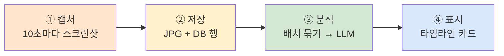
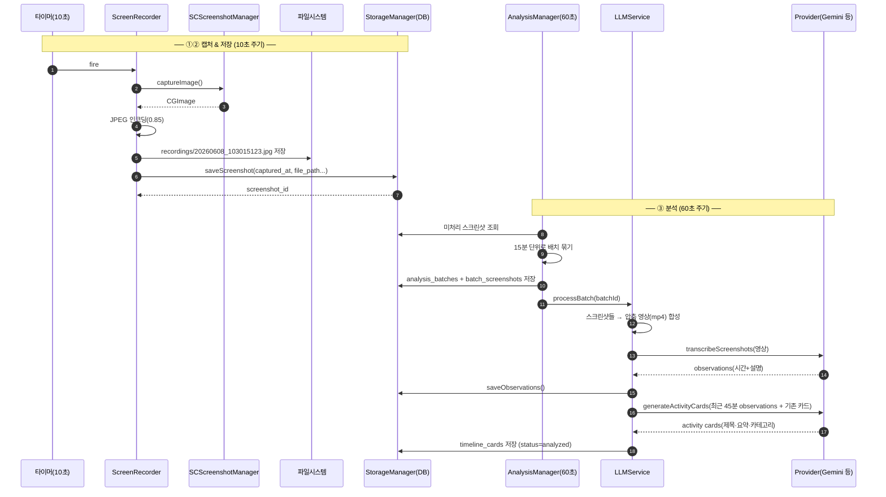
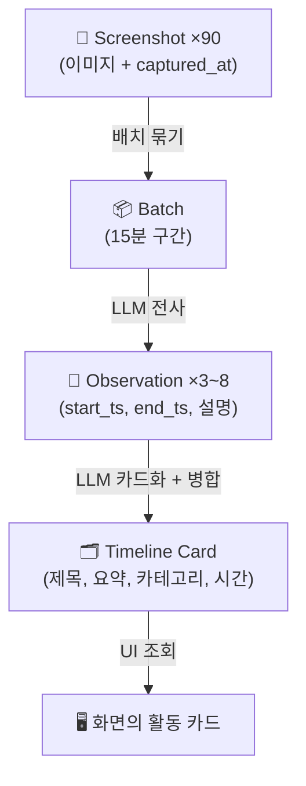

# 02. 데이터 파이프라인 — "데이터 한 조각의 일생"

> **이 문서에서 다루는 것**: 스크린샷 한 장이 찍혀서 사용자 화면의 활동 카드가 되기까지의
> 전 과정. 이 편을 이해하면 Dayflow의 80%를 이해한 것입니다.
>
> **선행 지식**: [01. 아키텍처](01-architecture.md)

---

## 1. 4단계 큰 그림

| 단계 | 주역 | 결과물 |
|------|------|--------|
| ① 캡처 | `ScreenRecorder` | 메모리상의 화면 이미지 |
| ② 저장 | `StorageManager` | `recordings/*.jpg` + `screenshots` 테이블 행 |
| ③ 분석 | `AnalysisManager` → `LLMService` → provider | `observations` + `timeline_cards` |
| ④ 표시 | `DailyView`/`JournalView` 등 | 사용자가 보는 카드 |

---

## 2. 스크린샷 한 장의 일생 (시퀀스)

> 💡 **왜 영상으로 합치나?** 스크린샷 90장(15분 × 6장/분)을 LLM에 따로따로 보내면 비싸고
> 느립니다. 짧은 mp4(예: 30초)로 합쳐 한 번에 보내고, 나중에 **압축 계수**로 영상 시간을
> 실제 시간으로 되돌립니다. [용어집](glossary.md) "compression factor" 참고.

---

## 3. 단계별 코드 위치

### ① 캡처 — `ScreenRecorder`
- 파일: [Core/Recording/ScreenRecorder.swift](../Dayflow/Dayflow/Core/Recording/ScreenRecorder.swift)
- 10초 타이머(`DispatchSourceTimer`) → `captureScreenshot()` → `SCScreenshotManager.captureImage()`
- 자세히는 [03편](03-recording-capture.md)

### ② 저장 — `StorageManager+Screenshots`
- 파일: [Core/Recording/StorageManager+Screenshots.swift](../Dayflow/Dayflow/Core/Recording/StorageManager+Screenshots.swift)
- 디스크 저장 + `screenshots` 테이블 INSERT (반환: `screenshot_id`)
- 스키마는 [04편](04-storage-grdb.md)

### ③ 분석 — `AnalysisManager` + `LLMService`
- 스케줄러: [Core/Analysis/AnalysisManager.swift](../Dayflow/Dayflow/Core/Analysis/AnalysisManager.swift) — 60초마다 `processRecordings()`
- 배치 처리: [Core/AI/LLMService.swift](../Dayflow/Dayflow/Core/AI/LLMService.swift) — `processBatch(batchId)` (6단계, [05편](05-ai-llm.md))
- provider별 구현: `GeminiDirectProvider+Transcription.swift`, `+ActivityCards.swift`

### ④ 표시 — 탭 View
- [Views/UI/JournalView.swift](../Dayflow/Dayflow/Views/UI/JournalView.swift), [DailyView.swift](../Dayflow/Dayflow/Views/UI/DailyView.swift) 등
- `StorageManager.fetchTimelineCardsByDate()` → 카드 렌더링
- 자세히는 [07편](07-ui-layer.md)

---

## 4. 데이터 모델의 변신 과정

같은 "10:30~10:45에 한 일"이 단계마다 다른 형태로 변합니다.

| 단계 | 타입 | "10:30 코딩"이 이렇게 표현됨 |
|------|------|------------------------------|
| 원재료 | `Screenshot` | VSCode 화면 이미지 90장 |
| 묶음 | `Batch` | 10:30~10:45 구간 1개 |
| 1차 기록 | `Observation` | "10:30-10:38 결제 모듈 디버깅, 10:38-10:45 PR 리뷰" |
| 최종 카드 | `TimelineCard` | 제목="결제 모듈 작업", 카테고리="개발", 10:30~10:45 |

---

## 5. 자주 헷갈리는 포인트

- **타임랩스 영상 아님**: 예전엔 연속 영상을 녹화했지만, 지금은 **주기적 스크린샷**입니다
  (프라이버시·성능). 영상은 분석 때 잠깐 합쳤다 버리는 임시물.
- **두 개의 타이머**: 캡처는 10초, 분석은 60초로 별개. 캡처가 데이터를 쌓고, 분석이
  나중에 따라가며 처리하는 **생산자-소비자** 구조.
- **카드는 병합된다**: 새 observation이 들어오면 기존 카드와 합쳐 자연스러운 카드로
  다듬습니다(분할보다 병합 우선). 그래서 카드가 "갱신"될 수 있음.
- **상태 컬럼**: 배치/카드에 `status`(processing/analyzed 등)가 있어 어디까지 처리됐는지 추적.

---

## 다음 편 예고
👉 [03. 화면 캡처](03-recording-capture.md) — ①캡처 단계를 현미경으로. ScreenCaptureKit,
상태머신, 프라이버시 필터를 들여다봅니다.
