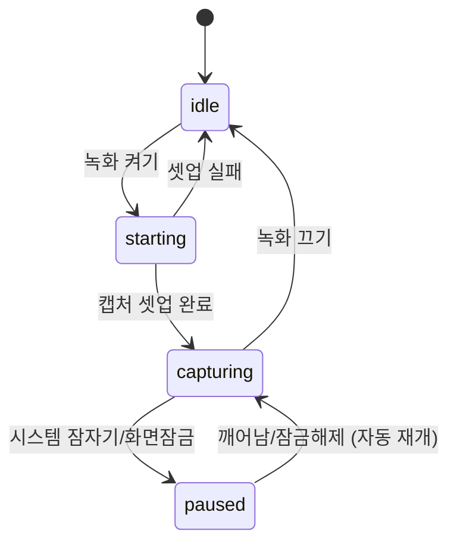
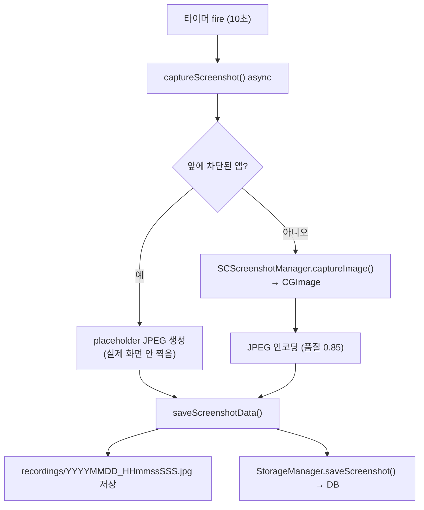
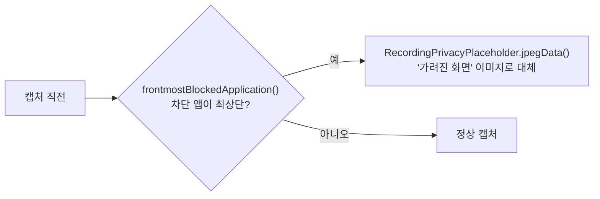

# 03. 화면 캡처 (Recording)

> **이 문서에서 다루는 것**: 파이프라인 ①캡처 단계. ScreenCaptureKit으로 어떻게 스크린샷을
> 찍고, 어떤 상태를 거치며, 민감한 화면을 어떻게 가리는지.
>
> **선행 지식**: [02. 데이터 파이프라인](02-data-pipeline.md)

핵심 파일: [Core/Recording/ScreenRecorder.swift](../Dayflow/Dayflow/Core/Recording/ScreenRecorder.swift)

---

## 1. 핵심 개념: 영상이 아니라 "스냅샷"

Dayflow는 화면을 연속 녹화하지 않습니다. **10초마다 화면을 한 장씩** 찍습니다.

- 장점: 디스크 절약, CPU 부담 적음, 프라이버시(연속 영상보다 덜 침습적)
- 도구: `ScreenCaptureKit`의 **`SCScreenshotManager.captureImage()`** (연속 `SCStream` 아님)

> 💡 **ScreenCaptureKit**: Apple이 macOS 12.3+에 도입한 화면 캡처 프레임워크. 권한 모델이
> 엄격하고 성능이 좋아 구식 API(`CGWindowListCreateImage`)를 대체.

캡처 간격은 코드에 박혀있지 않고 설정 가능합니다:
- [ScreenRecorder.swift:21-36](../Dayflow/Dayflow/Core/Recording/ScreenRecorder.swift#L21) `ScreenshotConfig.interval`
- UserDefaults 값이 있으면 그걸, 없으면 **기본 10초**.

---

## 2. 상태 머신 (RecorderState)

녹화기는 여러 상태를 오갑니다. [ScreenRecorder.swift:66-71](../Dayflow/Dayflow/Core/Recording/ScreenRecorder.swift#L66)

| 상태 | 의미 |
|------|------|
| `idle` | 캡처 안 함 |
| `starting` | 캡처 셋업 진행 중 |
| `capturing` | 타이머 돌며 활발히 캡처 |
| `paused` | 시스템 이벤트(잠자기/잠금)로 일시정지, **자동 재개됨** |

> 💡 왜 `paused`가 따로 있나? 맥이 잠자기에 들어가면 캡처해봐야 검은 화면뿐. 자원 낭비를
> 막고, 깨어나면 사용자 개입 없이 알아서 다시 `capturing`으로 돌아갑니다.

---

## 3. 캡처 한 사이클의 내부

관련 위치:
- 캡처 본체: [ScreenRecorder.swift:337-435](../Dayflow/Dayflow/Core/Recording/ScreenRecorder.swift#L337)
- 타이머: [ScreenRecorder.swift:315-328](../Dayflow/Dayflow/Core/Recording/ScreenRecorder.swift#L315) (`DispatchSourceTimer`)

---

## 4. 디스플레이 선택 (모니터 여러 대면?)

`SCShareableContent.excludingDesktopWindows()`로 캡처 가능한 디스플레이를 조회한 뒤
우선순위로 고릅니다:

1. 명시적으로 요청된 디스플레이
2. `ActiveDisplayTracker`가 추적 중인 활성 디스플레이
3. 첫 번째 디스플레이

관련 파일: [ActiveDisplayTracker.swift](../Dayflow/Dayflow/Core/Recording/ActiveDisplayTracker.swift),
셋업 로직 [ScreenRecorder.swift:224-311](../Dayflow/Dayflow/Core/Recording/ScreenRecorder.swift#L224)

---

## 5. 프라이버시 필터 (민감 화면 가리기)

비밀번호 관리자, 뱅킹 앱 등을 켜놓았을 때 그 화면을 그대로 저장하면 안 됩니다.
[ScreenRecorder.swift:356-383](../Dayflow/Dayflow/Core/Recording/ScreenRecorder.swift#L356)

- 차단 목록 관리: [RecordingPrivacyPreferences.swift](../Dayflow/Dayflow/Core/Recording/RecordingPrivacyPreferences.swift)
- placeholder 생성: [RecordingPrivacyPlaceholder.swift](../Dayflow/Dayflow/Core/Recording/RecordingPrivacyPlaceholder.swift)
- 효과: DB에는 행이 남지만 이미지는 "가려짐" placeholder라 분석에도 안전.

---

## 6. 녹화 시작/정지는 누가 호출하나

- 자동 시작: `AppDelegate`가 부팅 시 [AppState.shared](../Dayflow/Dayflow/App/AppState.swift)의 녹화 플래그를 보고 시작.
- 수동 토글: 메뉴바([09편](09-system-release.md))의 Pause/Resume → `PauseManager`/`RecordingControl`.
- `ScreenRecorder`는 `AppState.$isRecording`을 **구독**하다가 값이 바뀌면 상태 전환.

---

## 7. 주니어가 자주 막히는 곳

- **권한 안 주면 무한 빈 캡처**: 화면 기록 권한이 없으면 캡처가 실패하거나 검은 화면.
  [00편 4-3](00-getting-started.md) 권한 설정 참고.
- **간격 바꾸기**: 디버깅 때 10초가 길면 UserDefaults로 줄이면 됨(테스트용). 단, 너무
  짧으면 분석 비용↑.
- **`paused`인데 안 깨어남**: 시스템 이벤트 옵저버 등록 문제일 수 있음 → 로그에서
  상태 전환(`dbg`) 추적.

---

## 다음 편 예고
👉 [04. 저장소 / GRDB](04-storage-grdb.md) — 찍은 스크린샷이 들어가는 DB의 구조,
테이블 11개와 마이그레이션을 봅니다.
