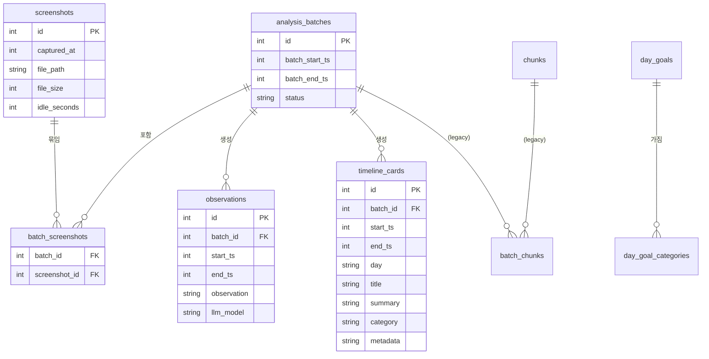
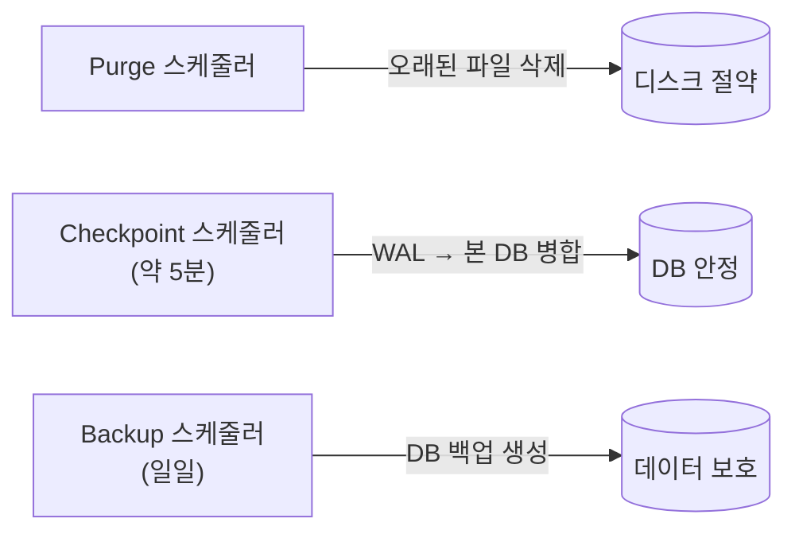

# 04. 저장소 / GRDB

> **이 문서에서 다루는 것**: 파이프라인 ②저장 단계. DB 기술(GRDB·WAL), 테이블 구조,
> 마이그레이션, 그리고 `StorageManager` 가족이 어떻게 나뉘어 있는지.
>
> **선행 지식**: [02. 데이터 파이프라인](02-data-pipeline.md)

핵심 파일: [Core/Recording/StorageManager.swift](../Dayflow/Dayflow/Core/Recording/StorageManager.swift)

---

## 1. 저장 기술 한눈에

| 항목 | 값 | 의미 |
|------|-----|------|
| DB | SQLite (파일 1개) | 서버 불필요, 로컬 파일 |
| 라이브러리 | GRDB | Swift용 SQLite ORM |
| 연결 | `DatabasePool` | 읽기 동시·쓰기 직렬 ([:180](../Dayflow/Dayflow/Core/Recording/StorageManager.swift#L180)) |
| 모드 | WAL | 읽기/쓰기 동시 가능 |
| DB 파일 | `chunks.sqlite` | [:216](../Dayflow/Dayflow/Core/Recording/StorageManager.swift#L216) |
| 쓰기 큐 | `com.dayflow.storage.writes` | 모든 쓰기를 한 줄로 직렬화 ([:192](../Dayflow/Dayflow/Core/Recording/StorageManager.swift#L192)) |

> 💡 **왜 쓰기 전용 큐?** SQLite는 동시 쓰기에 약합니다. 모든 INSERT/UPDATE를 한 큐로 모아
> 순서대로 실행하면 잠금 충돌(lock contention)을 피할 수 있습니다. 읽기는 WAL 덕에 여러 개
> 동시에 가능.

> ⚠️ 파일 이름이 `chunks.sqlite`인 건 **역사적 잔재**입니다. 초기엔 영상 "chunk"를 저장했고
> 지금은 스크린샷 기반인데 파일명은 그대로 둔 것. 헷갈리지 마세요.

---

## 2. 테이블 지도 (ER 다이어그램)

실제 `CREATE TABLE`로 확인된 13개 테이블:

전체 테이블 목록과 역할:

| 테이블 | 역할 |
|--------|------|
| `screenshots` | 10초마다 찍은 스크린샷 메타(시간·파일경로·유휴초) — **분석 원재료** |
| `analysis_batches` | 스크린샷을 15분 단위로 묶은 분석 배치 |
| `batch_screenshots` | 배치 ↔ 스크린샷 연결(junction) |
| `observations` | LLM 1차 전사 결과(시간+설명) |
| `timeline_cards` | 최종 활동 카드(제목·요약·카테고리·시간·metadata JSON) |
| `timeline_review_ratings` | 사용자가 시간대에 매긴 평가 |
| `llm_calls` | 모든 LLM 호출 로그(디버깅·비용 추적) |
| `journal_entries` | 사용자 저널(아침 의도/저녁 회고) |
| `daily_standup_entries` | 일일 스탠드업 JSON |
| `day_goals` / `day_goal_categories` | 하루 목표 + 목표 카테고리 |
| `chunks` / `batch_chunks` | **legacy**(옛 영상 청크) — 지금은 미사용 |

> 스키마 정의 위치: [StorageManager.swift:458-649](../Dayflow/Dayflow/Core/Recording/StorageManager.swift#L458) 근처의
> `CREATE TABLE IF NOT EXISTS ...`.

---

## 3. 시간은 어떻게 저장되나

- 대부분 `*_ts` 컬럼은 **Unix epoch 초**(정수). 예: `1749369015`.
- 스크린샷 파일명은 `YYYYMMDD_HHmmssSSS.jpg` (로컬 시간 기반, 사람이 보기 쉽게).
- 카드의 `day`는 **새벽 4시 경계**로 계산한 "논리적 하루" 문자열.
  - 💡 왜? 새벽 1시 작업이 "전날"로 묶이게 하려고. 자정에 끊으면 야근이 두 날로 쪼개짐.

---

## 4. 마이그레이션 (스키마 버전업)

DB 구조를 바꿔야 할 때(컬럼 추가 등) 안전하게 처리하는 단계들.

- 스키마 마이그레이션: [StorageManager+Migrations.swift](../Dayflow/Dayflow/Core/Recording/StorageManager+Migrations.swift)
- 저장 경로 이전: [Utilities/StoragePathMigrator.swift](../Dayflow/Dayflow/Utilities/StoragePathMigrator.swift)
- UserDefaults 이전: [Utilities/UserDefaultsMigrator.swift](../Dayflow/Dayflow/Utilities/UserDefaultsMigrator.swift) — `AppDelegate`가 부팅 때 호출

> ⚠️ **마이그레이션 안전 규칙**: 컬럼 추가는 `ALTER TABLE ... ADD COLUMN`으로. 기존 행이
> 깨지지 않게 항상 기본값/NULL 허용. DROP/이름변경은 데이터 손실 위험이라 신중히. 변경 전
> 백업 스케줄러가 도는지 확인.

---

## 5. StorageManager "가족" (확장 12개)

거대한 `StorageManager`를 도메인별 파일로 쪼갰습니다. 기능을 찾을 땐 파일명을 보세요.

| 확장 파일 | 담당 |
|-----------|------|
| `StorageManager+Screenshots.swift` | 스크린샷 저장/조회 |
| `StorageManager+Observations.swift` | observation CRUD |
| `StorageManager+TimelineCards.swift` | 타임라인 카드 CRUD/변환 |
| `StorageManager+Journal.swift` | 저널 엔트리 |
| `StorageManager+DailyStandup.swift` | 스탠드업 데이터 |
| `StorageManager+DayGoals.swift` | 하루 목표 |
| `StorageManager+TimelineReview.swift` | 시간대 평가 |
| `StorageManager+Chunks.swift` | legacy 청크 |
| `StorageManager+Reprocessing.swift` | 재분석(카드 다시 만들기) |
| `StorageManager+Maintenance.swift` | 정리·체크포인트·백업 |
| `StorageManager+Migrations.swift` | 스키마 마이그레이션 |
| `StorageManaging.swift` | 프로토콜(인터페이스 정의) |

---

## 6. 자동 유지보수 (Maintenance)

[StorageManager+Maintenance.swift](../Dayflow/Dayflow/Core/Recording/StorageManager+Maintenance.swift)가
백그라운드에서 자동으로:

> 💡 **slow query 추적**: `DatabaseContentionTracker`가 100ms 넘는 쿼리를 로깅합니다.
> 성능 문제 디버깅 때 여기 로그를 보세요.

---

## 다음 편 예고
👉 [05. AI / LLM](05-ai-llm.md) — 저장된 스크린샷을 실제로 "이해"하는 AI 계층.
provider 4종과 `processBatch` 6단계를 봅니다.
