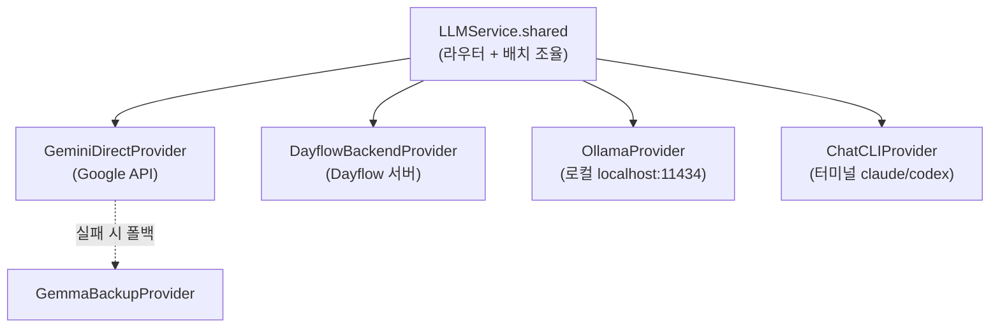
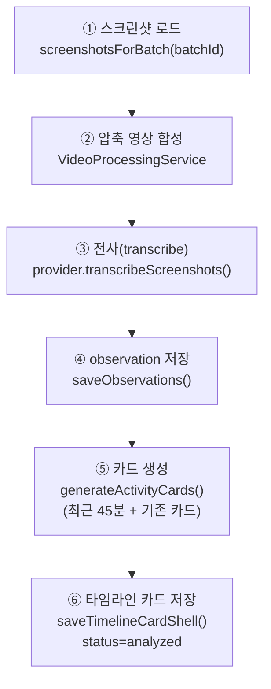

# 05. AI / LLM

> **이 문서에서 다루는 것**: 파이프라인 ③분석의 핵심. LLM provider 4종, 추상화 구조,
> 프롬프트 위치, 그리고 배치 한 개를 처리하는 `processBatch` 6단계.
>
> **선행 지식**: [02. 데이터 파이프라인](02-data-pipeline.md), [04. 저장소](04-storage-grdb.md)

핵심 파일: [Core/AI/LLMService.swift](../Dayflow/Dayflow/Core/AI/LLMService.swift)

---

## 1. provider 추상화 — "AI를 갈아끼울 수 있다"

Dayflow는 특정 AI에 묶이지 않습니다. `LLMService`가 공통 인터페이스를 정의하고, 실제 호출은
4개 provider 중 사용자가 고른 것으로 위임합니다.



| Provider | 파일 | 특징 |
|----------|------|------|
| Gemini | `GeminiDirectProvider.swift`(+확장 다수) | 기본 클라우드, 영상 업로드 분석 |
| Dayflow Backend | `DayflowBackendProvider.swift` | Dayflow 서버 경유(토큰 인증) |
| Ollama | `OllamaProvider.swift` | 완전 로컬, 오프라인 |
| Chat CLI | `ChatCLIProvider.swift`(+확장) | 설치된 CLI를 stdin/stdout으로 |
| Gemma(폴백) | `GemmaBackupProvider.swift` | Gemini 실패 시 자동 대체 |

> 💡 **공통 인터페이스란?** 모든 provider는 `transcribeScreenshots(...)`와
> `generateActivityCards(...)` 두 메서드를 똑같은 모양으로 제공합니다. 그래서 `LLMService`는
> "누가 실제 AI인지" 몰라도 됩니다. 새 AI 추가법은 [10편 레시피](10-recipes-faq.md).

---

## 2. processBatch — 배치 한 개 처리 6단계

[LLMService.swift:562-829](../Dayflow/Dayflow/Core/AI/LLMService.swift#L562) `processBatch(batchId:)`



| 단계 | 하는 일 | 결과 |
|------|---------|------|
| ① 로드 | 배치에 속한 스크린샷 조회 | `[Screenshot]` |
| ② 영상합성 | 스크린샷들을 짧은 mp4로 (FPS=1) | 임시 mp4 |
| ③ 전사 | LLM이 영상 보고 시간별 설명 | `[Observation]` |
| ④ 저장 | observation을 DB에 | `observations` 행 |
| ⑤ 카드화 | observation + 기존 카드 병합 → 활동 카드 | `[ActivityCardData]` |
| ⑥ 저장 | 카드를 DB에 | `timeline_cards` 행 |

> 💡 **왜 ⑤에서 "최근 45분 + 기존 카드"를 같이 보내나?** 새 15분 배치만 보면 맥락이 끊깁니다.
> 직전 활동과 이어지는지 알아야 "코딩"이 두 카드로 쪼개지지 않고 한 카드로 합쳐집니다.
> 이게 **병합 우선** 정책.

---

## 3. 압축 타임스탬프 (영상 시간 → 실제 시간)

② 단계에서 15분(900초)을 짧은 영상(예: 30초)으로 압축합니다. LLM은 "영상 0:05~0:12"처럼
영상 기준 시간을 답합니다. 이걸 실제 시간으로 되돌리는 게 **압축 계수(compression factor)**.

```
실제 시작 = 배치 시작시각 + (영상_초 × 압축계수)
예: 배치 10:30 시작, 압축계수 30, 영상 0:05 → 10:30 + 150초 = 10:32:30
```

전사 코드/프롬프트: [GeminiDirectProvider+Transcription.swift:40](../Dayflow/Dayflow/Core/AI/GeminiDirectProvider+Transcription.swift#L40)

---

## 4. 프롬프트는 어디에 있나

| 용도 | 파일 | 핵심 지시 |
|------|------|-----------|
| 전사(observation) | `GeminiDirectProvider+Transcription.swift` | "영상을 3~8개 구간으로 나눠 MM:SS로, 앱/파일/URL 명시" |
| 카드 생성 | `GeminiDirectProvider+ActivityCards.swift` | "기존 카드와 병합, 카테고리·distraction·앱 주석" |
| 대시보드 채팅 | `GeminiDirectProvider+DashboardChat.swift` 등 | Q&A, 도구 호출 |
| provider별 변형 | `OllamaPromptPreferences.swift`, `ChatCLIProvider+Prompts.swift`, `GeminiPromptPreferences.swift` | provider 특성에 맞춘 프롬프트 |

> 💡 프롬프트를 바꾸면 분석 품질이 직접 바뀝니다. 실험 시 `llm_calls` 테이블([04편](04-storage-grdb.md))에
> 입출력이 로깅되니 비교에 쓰세요.

---

## 5. 배치 설정값 (BatchingConfig)

[Core/AI/LLMTypes.swift](../Dayflow/Dayflow/Core/AI/LLMTypes.swift)

| 설정 | 값 | 의미 |
|------|-----|------|
| 목표 배치 길이 | 15분 | 한 배치가 다루는 시간 |
| 최대 갭 | 2분 | 스크린샷 간격이 이보다 크면 배치 분리 |
| 카드 lookback | 45분 | 카드 생성 시 참고할 과거 범위 |

> 💡 "최대 갭"이 왜 필요? 점심 1시간 자리를 비우면 그 전후를 한 배치로 묶으면 안 됨. 갭이
> 크면 끊어서 별도 배치로.

---

## 6. 검증 & 재시도

카드 생성 후 시간 커버리지/연속성을 검증하고, 이상하면 프롬프트를 보강해 **최대 4회 재시도**합니다.
- 검증: `validateTimeCoverage()`, `validateTimeline()`
- 폴백: Gemini 실패 시 `GemmaBackupProvider`로 자동 전환

---

## 7. 채팅 & 일일 요약 (보너스 AI 기능)

| 기능 | 파일 | 설명 |
|------|------|------|
| 대시보드 채팅 | [ChatService.swift](../Dayflow/Dayflow/Core/AI/ChatService.swift) | 타임라인 Q&A, 메모리, 도구 호출 |
| 도구 실행 | [ChatToolExecutor.swift](../Dayflow/Dayflow/Core/AI/ChatToolExecutor.swift) | "타임라인 검색" 같은 함수 호출 |
| 일일 요약 | [DailyRecapGenerator.swift](../Dayflow/Dayflow/Core/AI/DailyRecapGenerator.swift) | 하이라이트/우선순위/블로커 생성 |
| 요약 스케줄 | [DailyRecapScheduler.swift](../Dayflow/Dayflow/Core/AI/DailyRecapScheduler.swift) | 저녁에 자동 생성 |

---

## 다음 편 예고
👉 [06. 분석 / 집계](06-analysis-aggregation.md) — `processBatch`를 누가 언제 부르는지
(스케줄러), 그리고 주간/일일 통계를 어떻게 계산하는지.
