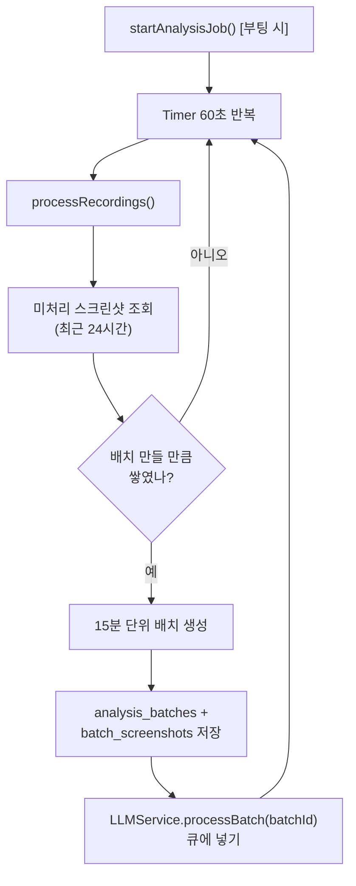
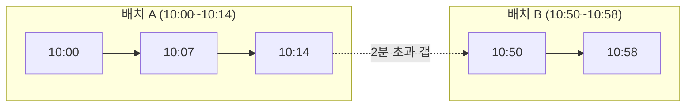
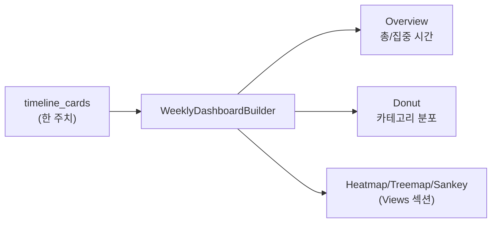

# 06. 분석 / 집계

> **이 문서에서 다루는 것**: `processBatch`를 **누가 언제 부르는지**(스케줄러), 배치가 어떻게
> 만들어지는지, 그리고 주간/일일 통계가 어떻게 계산되는지.
>
> **선행 지식**: [05. AI / LLM](05-ai-llm.md)

핵심 파일: [Core/Analysis/AnalysisManager.swift](../Dayflow/Dayflow/Core/Analysis/AnalysisManager.swift)

---

## 1. 분석 스케줄러 (심장 박동)

`AnalysisManager`는 **60초마다** 깨어나 "처리할 게 있나?" 확인합니다.
[AnalysisManager.swift:44](../Dayflow/Dayflow/Core/Analysis/AnalysisManager.swift#L44) `checkInterval = 60`

| 설정 | 값 | 위치 |
|------|-----|------|
| 체크 주기 | 60초 | [:44](../Dayflow/Dayflow/Core/Analysis/AnalysisManager.swift#L44) |
| 조회 범위 | 최근 24시간 | [:45](../Dayflow/Dayflow/Core/Analysis/AnalysisManager.swift#L45) `maxLookback` |
| 최소 배치 길이 | 12분 | [:690](../Dayflow/Dayflow/Core/Analysis/AnalysisManager.swift#L690) |

> 💡 **생산자-소비자 다시 보기**: [03편](03-recording-capture.md)의 캡처(10초)가 **생산자**,
> 여기 분석(60초)이 **소비자**. 캡처가 `screenshots`를 쌓으면 분석이 나중에 따라가며 묶고
> LLM에 던집니다. 둘이 독립적이라 한쪽이 느려도 다른 쪽은 계속 돕니다.

---

## 2. 배치 생성 규칙

미처리 스크린샷을 시간 순으로 보며 묶습니다([05편 BatchingConfig](05-ai-llm.md) 참고):

- 목표 **15분**씩 한 배치
- 스크린샷 간격이 **2분 초과**면(자리 비움 등) 배치를 끊음
- 너무 짧은 배치(< 12분)는 아직 처리 보류(다음 캡처를 기다림)

---

## 3. 미처리 판별 — "이미 분석했나?"

`screenshots`에 있지만 `batch_screenshots`에 아직 안 들어간 스크린샷이 "미처리".
즉 **배치에 안 묶인 것** = 아직 분석 안 한 것. 이 조인 쿼리로 골라냅니다.

---

## 4. 일일 집계 (Daily)

타임라인 카드를 모아 하루 단위로 요약·시각화:
- 카드 조회 → 카테고리별 시간 합산 → GitHub 스타일 활동 그리드
- AI 스탠드업은 [DailyRecapGenerator](05-ai-llm.md) 담당
- 표시는 [DailyView](07-ui-layer.md)

---

## 5. 주간 집계 (Weekly)

`Core/Weekly/`의 빌더들이 한 주치 카드를 통계로 변환합니다.

| 빌더 | 산출물 |
|------|--------|
| [WeeklyDashboardBuilder.swift](../Dayflow/Dayflow/Core/Weekly/WeeklyDashboardBuilder.swift) | 주간 대시보드 전체 조립 |
| [WeeklyOverviewBuilder.swift](../Dayflow/Dayflow/Core/Weekly/WeeklyOverviewBuilder.swift) | 개요(총 시간·집중 시간) |
| [WeeklyDonutBuilder.swift](../Dayflow/Dayflow/Core/Weekly/WeeklyDonutBuilder.swift) | 카테고리별 시간 도넛 차트 |
| [WeeklyDateRange.swift](../Dayflow/Dayflow/Core/Weekly/WeeklyDateRange.swift) | "이번 주"의 시작/끝 계산 |

---

## 6. 시간 파싱 & 4AM 경계

[Core/Analysis/TimeParsing.swift](../Dayflow/Dayflow/Core/Analysis/TimeParsing.swift)가 시간 문자열↔타임스탬프 변환을 담당.
"하루"를 자정이 아니라 **새벽 4시**에 끊는 규칙이 여기 녹아 있습니다.

> 💡 야근족 배려: 새벽 2시에 한 일을 "오늘 새벽"이 아니라 "어제 밤"으로 묶으려는 의도.

---

## 7. 기능 언락과의 연결

분석된 배치 수가 곧 기능 언락 기준입니다([08편](08-onboarding-access.md)):
- 완료 배치 카운트: `StorageManager.countCompletedAnalysisBatchesForWeeklyAccess()`
- 1배치 = 15분 → Daily 5h=20배치, Chat 10h=40배치, Weekly 30h=120배치

---

## 다음 편 예고
👉 [07. UI 계층](07-ui-layer.md) — 지금까지 만든 데이터를 사용자가 보는 화면. View 트리와
7개 탭, 사용자 여정을 봅니다.
