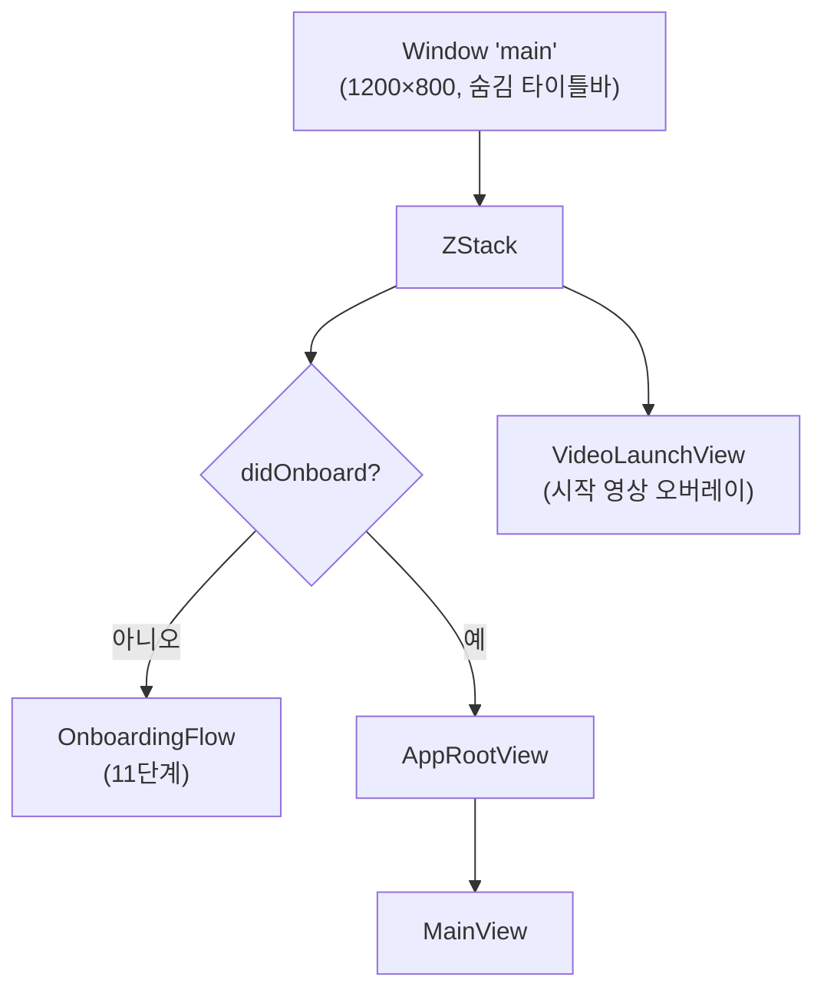
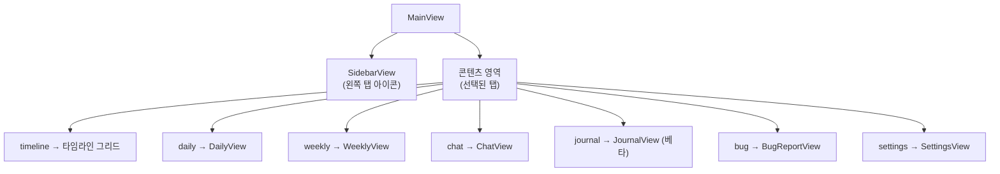
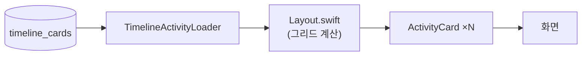
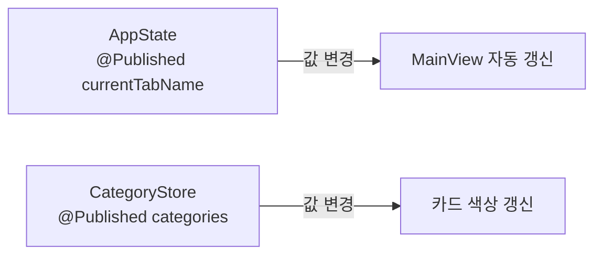
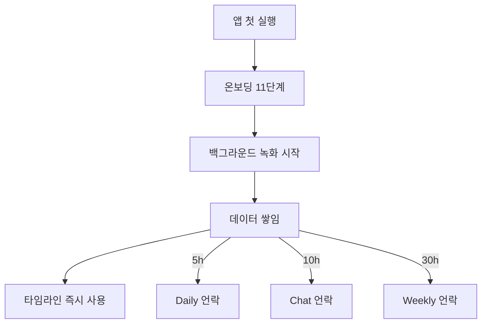

# 07. UI 계층

> **이 문서에서 다루는 것**: 사용자가 실제로 보는 화면들. 전체 View 트리, 7개 탭의 역할,
> 메인 레이아웃 구조, 그리고 사용자 여정.
>
> **선행 지식**: [01. 아키텍처](01-architecture.md), [02. 데이터 파이프라인](02-data-pipeline.md)

핵심 파일: [Views/UI/MainView/MainView.swift](../Dayflow/Dayflow/Views/UI/MainView/MainView.swift)

---

## 1. 윈도우 구조

Dayflow는 단일 윈도우 + 메뉴바 앱입니다. [App/DayflowApp.swift](../Dayflow/Dayflow/App/DayflowApp.swift)

- 온보딩 미완료면 [OnboardingFlow](08-onboarding-access.md), 완료면 `AppRootView → MainView`.
- 환경 객체(`AppState`, `CategoryStore` 등)는 `AppRootView`에서 주입.

---

## 2. 전체 View 트리

탭 정의: [Views/UI/MainView/SidebarView.swift:18-70](../Dayflow/Dayflow/Views/UI/MainView/SidebarView.swift#L18) `SidebarIcon` enum

| 탭 | View 파일 | 역할 | 언락 조건 |
|----|-----------|------|-----------|
| timeline | `MainView/Layout.swift`, `ActivityCard.swift` | 하루 활동 타임라인 | 즉시 |
| daily | [DailyView.swift](../Dayflow/Dayflow/Views/UI/DailyView.swift) | 일일 스탠드업·대시보드 | 5시간 |
| weekly | [Weekly/WeeklyView.swift](../Dayflow/Dayflow/Views/UI/Weekly/WeeklyView.swift) | 주간 분석 | 30시간 |
| chat | [ChatView.swift](../Dayflow/Dayflow/Views/UI/ChatView.swift) | 타임라인 Q&A | 10시간(베타) |
| journal | [JournalView.swift](../Dayflow/Dayflow/Views/UI/JournalView.swift) | 저널·회고 | 베타 코드 |
| bug | BugReportView | 버그 신고 | 즉시 |
| settings | [SettingsView.swift](../Dayflow/Dayflow/Views/UI/SettingsView.swift) | 설정(AI·저장소·권한) | 즉시 |

> 언락 조건 상세는 [08편](08-onboarding-access.md).

---

## 3. 타임라인 탭 내부 (가장 복잡)

`Views/UI/MainView/`에 거대한 레이아웃 로직이 있습니다.

| 파일 | 역할 |
|------|------|
| `MainView.swift` | 탭 선택·날짜 네비·사이드바 골격 |
| `Layout.swift` (큼) | 타임라인 그리드 배치·모드 전환·애니메이션 |
| `ActivityCard.swift` (큼) | 활동 카드 한 장의 시각적 렌더링 |
| `WeekTimelineGridView.swift` | 주간 그리드(일별 컬럼) |
| `TimelineActivityLoader.swift` | 카드 데이터 로딩·필터 |
| `DateNavigationControls.swift` | 날짜 선택기 |
| `Actions.swift` | 삭제·복사·내보내기 동작 |

> 💡 `Layout.swift`와 `ActivityCard.swift`가 수만 바이트로 큽니다. 처음엔 전부 읽지 말고
> "어떤 데이터가 들어와서 어떤 뷰가 나가는지"만 잡으세요.

---

## 4. 상태 관리 (누가 화면을 갱신하나)

| 객체 | 타입 | 역할 |
|------|------|------|
| [AppState.shared](../Dayflow/Dayflow/App/AppState.swift) | `@MainActor ObservableObject` | 녹화 on/off, 현재 탭, 타임라인 모드 |
| `CategoryStore` | `ObservableObject` | 활동 카테고리 목록·색상 |

> 💡 **@Published / ObservableObject**: 값이 바뀌면 그걸 구독하는 SwiftUI 뷰가 자동으로
> 다시 그려집니다. 수동으로 "새로고침"을 호출할 필요가 없음.

---

## 5. 주간 탭 섹션들

`Views/UI/Weekly/Sections/`에 시각화 섹션이 모여 있습니다:
- Overview / Donut(카테고리 분포) / Treemap / Sankey(흐름) / Highlights / FocusHeatmap / InteractionGraph

데이터는 [06편](06-analysis-aggregation.md)의 Weekly 빌더가 만들고, 여기서 그립니다.

---

## 6. 재사용 컴포넌트

`Views/Components/`:
- `CategoryDonutChart.swift` — 도넛 차트
- `DaySummaryView.swift` — 일일 요약 카드
- `ChatMessageViews.swift` — 채팅 버블
- `TimelineCardColorPicker.swift` — 카드 색상 선택
- `DayGoalFlowView.swift` — 목표 설정 모달

---

## 7. 사용자 여정 (전체)

---

## 다음 편 예고
👉 [08. 온보딩 / 기능 언락](08-onboarding-access.md) — 첫 실행 11단계와 시간기반 언락,
그리고 Dayflow Pro의 정체.
