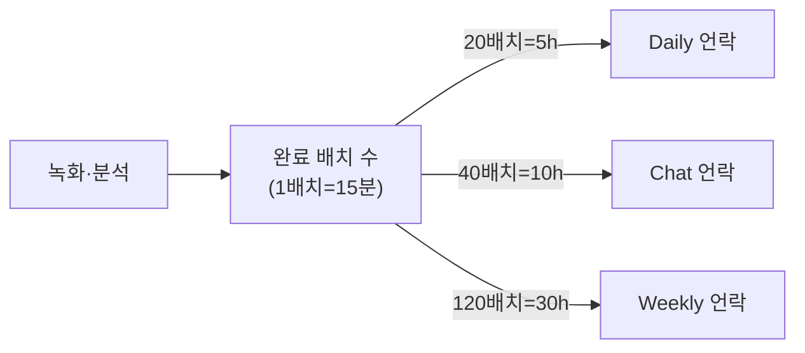

# 08. 온보딩 / 기능 언락

> **이 문서에서 다루는 것**: 첫 실행 11단계 온보딩, "시간을 쌓아야 기능이 열리는" 게이팅
> 방식, 그리고 Dayflow Pro의 정체(StoreKit 결제가 아님).
>
> **선행 지식**: [07. UI 계층](07-ui-layer.md)

핵심 파일: [Views/Onboarding/OnboardingFlow.swift](../Dayflow/Dayflow/Views/Onboarding/OnboardingFlow.swift),
[Core/Access/FeatureAccessRequirements.swift](../Dayflow/Dayflow/Core/Access/FeatureAccessRequirements.swift)

---

## 1. 온보딩 11단계

`OnboardingStep` enum이 순서를 정의합니다.
[OnboardingFlow.swift:22-36](../Dayflow/Dayflow/Views/Onboarding/OnboardingFlow.swift#L22)

```mermaid
flowchart LR
    S0["0 introVideo"] --> S1["1 roleSelection"]
    S1 --> S2["2 downloadReason"]
    S2 --> S3["3 referral"]
    S3 --> S4["4 preferences"]
    S4 --> S5["5 llmSelection"]
    S5 --> S6["6 llmSetup"]
    S6 --> S7["7 categories"]
    S7 --> S8["8 categoryColors"]
    S8 --> S9["9 screen(권한)"]
    S9 --> S10["10 completion"]
```

| 단계 | 화면 | 하는 일 |
|------|------|---------|
| 0 introVideo | 소개 영상 | 첫인상·동기부여 |
| 1 roleSelection | 역할 선택 | 엔지니어/디자이너/PM 등 → 카테고리 프리셋 |
| 2 downloadReason | 다운로드 이유 | 분석용 |
| 3 referral | 유입 경로 | 분석용 |
| 4 preferences | 개인 선호 | 설정 |
| 5 llmSelection | AI provider 선택 | Gemini/ChatGPT/Claude/Ollama |
| 6 llmSetup | AI 셋업 | API 키 입력 or 로컬 모델 |
| 7 categories | 카테고리 편집 | 활동 분류 정의 |
| 8 categoryColors | 색상 지정 | 카드 색 |
| 9 screen | 화면 녹화 권한 | macOS 권한 요청 |
| 10 completion | 완료 | 환영, 녹화 시작 |

상태 저장:
- `@AppStorage("didOnboard")` — 완료 플래그(이게 true면 메인 화면)
- `@AppStorage("onboardingStep")` — 현재 단계(중간에 종료해도 이어서)
- `OnboardingStepMigration`(currentVersion=5) — 온보딩 단계 구조가 바뀌어도 안전하게 복원

> 💡 각 단계는 `AnalyticsService`로 이벤트를 보냅니다(`onboarding_started`,
> `onboarding_step_completed` 등). [09편 분석](09-system-release.md) 참고.

---

## 2. 온보딩 관련 파일

| 파일 | 역할 |
|------|------|
| `OnboardingFlow.swift` | 단계 전환 컨트롤러 |
| `OnboardingLLMSelectionView.swift` | provider 고르기 |
| `LLMProviderSetupView.swift` / `LLMProviderSetupCLI.swift` | 셋업 UI |
| `APIKeyInputView.swift` | API 키 입력 |
| `OnboardingCategoryStepView.swift` | 카테고리 편집 |
| `ScreenRecordingPermissionView.swift` | 권한 요청 |
| `VideoLaunchView.swift` | 시작 영상 |
| `Prototype/` | 프로토타입 단계 컴포넌트들 |

---

## 3. 시간기반 기능 언락 (Feature Gating)

Dayflow는 **결제 대신 "사용 시간"으로 기능을 엽니다.** 분석을 많이 쌓을수록 더 깊은 기능이
열리는 구조.

[FeatureAccessRequirements.swift](../Dayflow/Dayflow/Core/Access/FeatureAccessRequirements.swift)

| 기능 | 필요 시간 | 코드 |
|------|-----------|------|
| Daily | 5시간 | `dailyRequiredHours = 5` ([:6](../Dayflow/Dayflow/Core/Access/FeatureAccessRequirements.swift#L6)) |
| Chat | 10시간 | `chatRequiredHours = 10` ([:7](../Dayflow/Dayflow/Core/Access/FeatureAccessRequirements.swift#L7)) |
| Weekly | 30시간 | 별도 스냅샷(`WeeklyAccessProgressSnapshot`) |

계산 방식: `requiredBatchCount = (시간 × 60) / 15분`
([:47-49](../Dayflow/Dayflow/Core/Access/FeatureAccessRequirements.swift#L47))

진행도 표시 텍스트("3h 30m / 5h")는 `progressText(...)`
([:25](../Dayflow/Dayflow/Core/Access/FeatureAccessRequirements.swift#L25))가 만듭니다.

> 💡 잠금 화면(`DailyAccessIntroView`, `WeeklyAccessLockedView`)은 "X시간 / 5시간" 진행도와
> "준비되면 알림" 버튼을 보여줍니다.

---

## 4. Journal 베타 (코드 잠금)

저널 탭은 시간이 아니라 **SHA256 해시 코드**로 잠겨 있습니다.
[JournalView.swift:26](../Dayflow/Dayflow/Views/UI/JournalView.swift#L26) `requiredCodeHash`

- 입력한 코드의 SHA256이 저장된 해시와 일치해야 열림(베타 테스터용).

---

## 5. Dayflow Pro — "결제가 아니다"

> ⚠️ **중요**: Dayflow에는 **StoreKit 인앱결제(IAP)가 없습니다.** Pro는 **계정/백엔드 기반**입니다.

- 최근 커밋이 Pro 가입 경로를 추가: `d7d417d onboarding: add dayflow pro signup path`,
  `074d1da onboarding: randomize referral source choices`.
- 계정·토큰 관리: [System/DayflowAuthManager.swift](../Dayflow/Dayflow/System/DayflowAuthManager.swift)
- 백엔드 인증 토큰은 PostHog distinct ID를 재사용(자세히는 [09편](09-system-release.md)).
- 즉, "Pro 가입 = Dayflow 계정 등록 → 백엔드 기능(Dayflow Backend provider 등) 접근"이지
  앱 내 결제 화면이 아닙니다.

---

## 6. 카테고리 시스템

온보딩 1단계 역할 선택이 `CategoryStore`에 프리셋을 깝니다.
- `CategoryStore.setOnboardingRole(...)` → 역할별 기본 카테고리
- 이후 사용자가 7·8단계에서 편집·색상 지정
- 카드 분석 시 LLM이 이 카테고리 중 하나로 분류([05편](05-ai-llm.md))

---

## 다음 편 예고
👉 [09. 시스템 / 릴리스](09-system-release.md) — 상태바, 권한, 분석(PostHog/Sentry),
Sparkle 자동 업데이트, 그리고 릴리스 스크립트.
