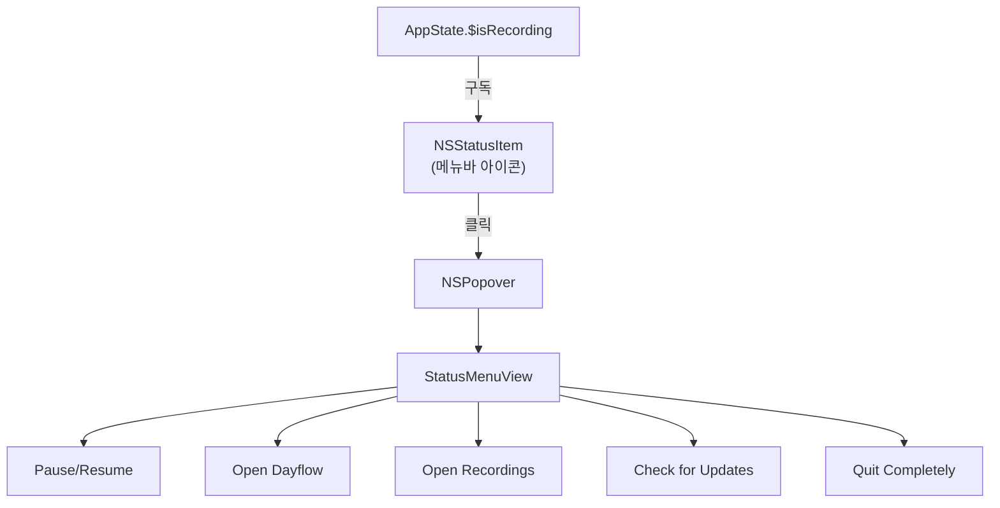
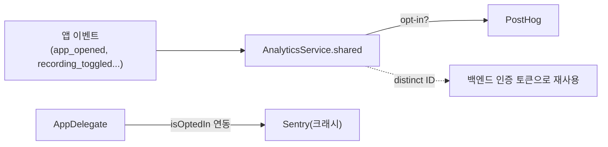
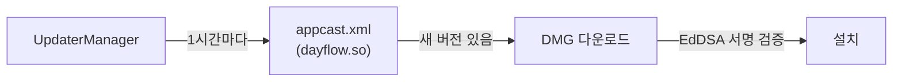
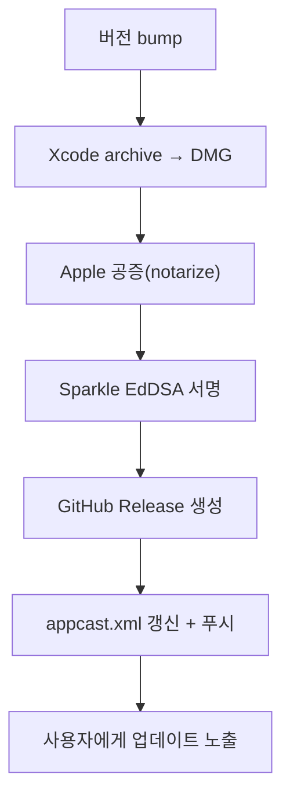

# 09. 시스템 / 릴리스

> **이 문서에서 다루는 것**: OS 통합 계층(메뉴바·권한·분석·업데이트)과 앱을 실제로 배포하는
> 릴리스 파이프라인.
>
> **선행 지식**: [01. 아키텍처](01-architecture.md)

핵심 폴더: [System/](../Dayflow/Dayflow/System/), [scripts/](../scripts/)

---

## 1. 메뉴바 앱 (Status Bar)

Dayflow는 Dock보다 **메뉴바 아이콘** 중심으로 동작합니다.

| 파일 | 역할 |
|------|------|
| [System/StatusBarController.swift](../Dayflow/Dayflow/System/StatusBarController.swift) | 메뉴바 아이콘 + 팝오버 |
| [Menu/StatusMenuView.swift](../Dayflow/Dayflow/Menu/StatusMenuView.swift) | 팝업 메뉴 내용 |

- 아이콘은 녹화 상태(`MenuBarOnIcon`/`OffIcon`)에 따라 바뀜.
- `Cmd+Q` 막기: `AppDelegate.allowTermination` — 백그라운드 유지가 목적.
- Dock 아이콘 숨김 옵션: `UserDefaults "showDockIcon"`.

---

## 2. 권한 & 딥링크

- 권한 확인: [Core/Access/](../Dayflow/Dayflow/Core/Access/), 알림 UI: [System/ScreenRecordingPermissionNotice.swift](../Dayflow/Dayflow/System/ScreenRecordingPermissionNotice.swift)
- 알림 탭 → 특정 탭 이동: [App/AppDeepLinkRouter.swift](../Dayflow/Dayflow/App/AppDeepLinkRouter.swift) (journal/daily/weekly 딥링크)
- 로그인 시 자동 실행: [System/LaunchAtLoginManager.swift](../Dayflow/Dayflow/System/LaunchAtLoginManager.swift)

---

## 3. 분석 (PostHog) & 크래시 (Sentry)

[System/AnalyticsService.swift](../Dayflow/Dayflow/System/AnalyticsService.swift)

- **opt-in 기본 ON** (`analyticsOptIn`), 사용자가 끌 수 있음.
- Sentry 활성화는 분석 opt-in과 연동: `SentryHelper.setEnabled(isOptedIn)`.
- PostHog **distinct ID를 백엔드 auth 토큰으로 재사용** — Daily/Weekly/Chat 백엔드 호출 인증에 사용.
- 이벤트 목록 전체: [Dayflow/Dayflow/AnalyticsEventDictionary.md](../Dayflow/Dayflow/AnalyticsEventDictionary.md)

> 💡 **distinct ID란?** PostHog가 사용자를 구분하는 고유 ID. Dayflow는 별도 계정 ID를 만들지
> 않고 이걸 그대로 백엔드 인증에도 씁니다(편의상). 디버그 override는 `dayflowBackendAuthTokenOverride`.

주요 이벤트: `app_opened`, `app_updated`, `onboarding_*`, `recording_toggled`,
`sparkle_check_triggered`, `whats_new_viewed`, `settings_opened`, `daily/chat/weekly_*`.

---

## 4. 자동 업데이트 (Sparkle)

[System/UpdaterManager.swift](../Dayflow/Dayflow/System/UpdaterManager.swift) +
[Info.plist](../Dayflow/Dayflow/Info.plist) 설정.

| Info.plist 키 | 값/의미 |
|---------------|---------|
| `SUFeedURL` | `https://dayflow.so/appcast.xml` ([:32](../Dayflow/Dayflow/Info.plist#L32)) |
| `SUScheduledCheckInterval` | 3600초(1시간) ([:36](../Dayflow/Dayflow/Info.plist#L36)) |
| `SUEnableAutomaticChecks` | 자동 확인 on ([:28](../Dayflow/Dayflow/Info.plist#L28)) |
| `SUPublicEDKey` | EdDSA 공개키(서명 검증용) |
| `CFBundleShortVersionString` | 마케팅 버전(예 1.14.0) ([:7](../Dayflow/Dayflow/Info.plist#L7)) |
| `CFBundleVersion` | 빌드 번호(예 112) ([:20](../Dayflow/Dayflow/Info.plist#L20)) |

- `SilentUserDriver` ([System/SilentUserDriver.swift](../Dayflow/Dayflow/System/SilentUserDriver.swift)): 사용자 프롬프트 최소화한 조용한 업데이트.
- 수동 확인은 메뉴바 "Check for Updates".

> 💡 **EdDSA 서명**: 업데이트 파일이 위변조되지 않았음을 보장. 공개키는 앱에(Info.plist),
> 개인키는 빌드 머신 Keychain에. 둘이 맞아야 설치됨.

---

## 5. 릴리스 파이프라인 (scripts/)

| 스크립트 | 역할 |
|----------|------|
| [scripts/release.sh](../scripts/release.sh) | 버전 증가 → DMG 빌드 → 공증 → 서명 → GitHub Release → appcast 갱신 (오케스트레이터) |
| [scripts/release_dmg.sh](../scripts/release_dmg.sh) | DMG 빌드·공증 |
| [scripts/make_appcast.sh](../scripts/make_appcast.sh) | appcast.xml 생성 |
| [scripts/update_appcast.sh](../scripts/update_appcast.sh) | appcast.xml 갱신·푸시 |
| [scripts/sparkle_sign_from_keychain.sh](../scripts/sparkle_sign_from_keychain.sh) | Keychain 개인키로 EdDSA 서명 |
| [scripts/release.env.example](../scripts/release.env.example) | 필요한 환경변수 템플릿 |

**필요물**: Xcode + Developer ID 인증서, Sparkle `sign_update`, `gh` CLI, (공증용) Apple ID/ASC 자격증명.

> ⚠️ **릴리스는 비가역**: GitHub Release·appcast가 공개되면 사용자가 즉시 받습니다. 버전·서명·
> 공증을 반드시 확인하고 진행하세요. 자세한 절차는 [10편](10-recipes-faq.md) "릴리스하기" 레시피.

---

## 6. 기타 System 유틸

| 파일 | 역할 |
|------|------|
| `ProcessCPUMonitor.swift` | CPU 사용량 모니터 |
| `TimelineFailureToast.swift` | 분석 실패 토스트 |
| `DayflowAuthManager.swift` | 계정/토큰(→ [08편 Pro](08-onboarding-access.md)) |

---

## 다음 편 예고
👉 [10. 레시피 & FAQ](10-recipes-faq.md) — "새 탭 추가하려면?", "새 AI provider 넣으려면?",
"녹화가 안 돼요" 같은 실전 how-to와 트러블슈팅.
