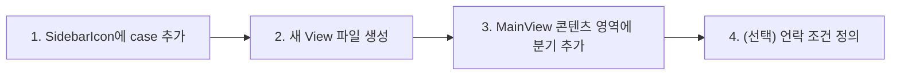
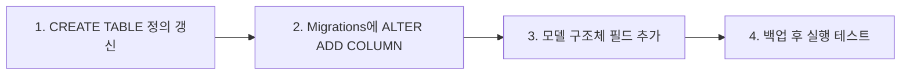

# 10. 레시피 & FAQ

> **이 문서에서 다루는 것**: 자주 하는 작업의 단계별 how-to와, 막혔을 때 보는 트러블슈팅.
>
> **선행 지식**: 앞 편들(특히 [01](01-architecture.md)·[04](04-storage-grdb.md)·[05](05-ai-llm.md))

---

## 레시피 (자주 하는 작업)

### 레시피 1: 새 탭 추가하기



1. [SidebarView.swift:18-70](../Dayflow/Dayflow/Views/UI/MainView/SidebarView.swift#L18) `SidebarIcon` enum에 새 case + 아이콘 추가.
2. `Views/UI/`에 새 `SomeView.swift` 작성.
3. [MainView.swift](../Dayflow/Dayflow/Views/UI/MainView/MainView.swift)의 선택 탭 `switch`에 case 연결.
4. 시간 언락이 필요하면 [FeatureAccessRequirements.swift](../Dayflow/Dayflow/Core/Access/FeatureAccessRequirements.swift)에 기준 추가 + 잠금 화면.

### 레시피 2: 새 LLM provider 추가하기

1. 기존 provider(`OllamaProvider.swift`)를 본보기로 `Core/AI/`에 새 파일 생성.
2. 공통 메서드 두 개 구현: `transcribeScreenshots(...)`, `generateActivityCards(...)`
   (시그니처는 [LLMTypes.swift](../Dayflow/Dayflow/Core/AI/LLMTypes.swift) 참고).
3. [LLMService.swift](../Dayflow/Dayflow/Core/AI/LLMService.swift)의 provider 선택 분기에 등록.
4. 온보딩 [OnboardingLLMSelectionView.swift](../Dayflow/Dayflow/Views/Onboarding/OnboardingLLMSelectionView.swift)에 선택지 추가 + 셋업 UI.
5. 프롬프트가 다르면 `*PromptPreferences.swift` 패턴으로 분리.

> 💡 핵심: provider는 "전사"와 "카드 생성" 두 가지만 같은 모양으로 제공하면 됨([05편 §1](05-ai-llm.md)).

### 레시피 3: DB 스키마 변경하기 (컬럼 추가)



1. [StorageManager.swift](../Dayflow/Dayflow/Core/Recording/StorageManager.swift)의 해당 `CREATE TABLE`에 컬럼 추가(신규 설치용).
2. [StorageManager+Migrations.swift](../Dayflow/Dayflow/Core/Recording/StorageManager+Migrations.swift)에 `ALTER TABLE ... ADD COLUMN`(기존 사용자용). **기본값/NULL 허용 필수.**
3. [StorageModels.swift](../Dayflow/Dayflow/Core/Recording/StorageModels.swift) 모델에 필드 추가.
4. 해당 `StorageManager+*.swift`의 INSERT/SELECT 갱신.

> ⚠️ DROP/이름변경은 데이터 손실 위험. 꼭 필요하면 백업 스케줄러 동작 확인 후, 새 컬럼으로
> 복사하는 방식으로.

### 레시피 4: 분석 이벤트 추가하기

1. [AnalyticsService.swift](../Dayflow/Dayflow/System/AnalyticsService.swift)의 `capture("이벤트명", [속성])` 호출.
2. [AnalyticsEventDictionary.md](../Dayflow/Dayflow/AnalyticsEventDictionary.md)에 이벤트 문서화(팀 컨벤션).
3. opt-out 사용자에겐 전송 안 됨(자동 처리).

### 레시피 5: 릴리스하기

1. `scripts/release.env.example`를 복사해 자격증명 채움.
2. [scripts/release.sh](../scripts/release.sh) 실행(버전 bump → DMG → 공증 → 서명 → GitHub Release → appcast).
3. 결과 확인: appcast.xml에 새 버전, GitHub Release 공개 여부.

> ⚠️ 비가역 작업. [09편 §5](09-system-release.md) 경고 참고.

---

## FAQ / 트러블슈팅

### Q1. 녹화가 안 돼요 (recordings/에 JPG가 안 쌓임)
1. **화면 기록 권한** 확인: 시스템 설정 → 개인정보 보호 및 보안 → 화면 기록 → Dayflow 체크.
2. 권한 준 뒤 **앱 재시작**(macOS는 권한 변경 후 재시작 필요할 때 많음).
3. 녹화가 켜졌는지: 메뉴바 아이콘 상태 / `AppState.isRecording`.
4. 로그에서 `RecorderState` 전환 확인([03편](03-recording-capture.md)). `paused`에 멈췄으면 잠자기/잠금 이벤트 의심.

### Q2. 분석이 안 돌아가요 (카드가 안 생김)
1. 스크린샷은 쌓이는데 카드가 없다 → **분석 단계** 문제([06편](06-analysis-aggregation.md)).
2. AI provider 셋업 확인: API 키 유효? Ollama 켜져 있나(`localhost:11434`)?
3. 배치가 최소 길이(12분)를 못 채웠을 수 있음 — 시간을 더 쌓아보기.
4. `llm_calls` 테이블에서 호출 실패/에러 확인([04편](04-storage-grdb.md)).
5. Gemini 실패 시 Gemma 폴백이 동작했는지 로그 확인.

### Q3. 기능이 잠겨 있어요 (Daily/Weekly/Chat)
- 시간기반 언락입니다([08편](08-onboarding-access.md)): Daily 5h / Chat 10h / Weekly 30h.
- 잠금 화면의 진행도("Xh / 5h")가 기준. 분석된 배치가 쌓여야 열림.

### Q4. 빌드가 실패해요
1. Xcode 16+ 인지 확인.
2. SPM 패키지 해석 실패 → File → Packages → Reset Package Caches.
3. 서명 오류 → 로컬 실행은 자동 서명으로 충분. 팀/인증서 설정 확인.
4. 자세한 진단은 빌드 에이전트(예: `/axiom:fix-build`) 활용.

### Q5. 데이터를 초기화하고 싶어요
- 앱 종료 후 `~/Library/Application Support/Dayflow/` 폴더를 백업·삭제.
- ⚠️ `chunks.sqlite`와 `recordings/`를 지우면 모든 타임라인이 사라집니다. **비가역.**

### Q6. DB를 직접 보고 싶어요
```bash
sqlite3 ~/Library/Application\ Support/Dayflow/chunks.sqlite
.tables
SELECT id, captured_at, file_path FROM screenshots ORDER BY captured_at DESC LIMIT 5;
```
> 앱 실행 중이면 잠금 가능 — 읽기 전용으로 열거나 앱을 잠시 종료.

### Q7. 같은 활동인데 카드가 여러 개로 쪼개져요
- 카드 생성은 병합 우선이지만 lookback(45분)을 벗어나면 맥락이 끊깁니다([05편](05-ai-llm.md)).
- 프롬프트나 BatchingConfig 조정으로 개선 가능.

### Q8. CPU/배터리를 너무 먹어요
- 캡처 간격(기본 10초)을 늘려보기([03편](03-recording-capture.md)).
- `ProcessCPUMonitor`([09편](09-system-release.md)) 로그로 어느 단계가 무거운지 확인.
- 영상 합성·LLM 호출이 무겁다면 분석 빈도/배치 크기 검토.

---

## 마무리

여기까지 읽었다면 Dayflow의 **캡처 → 저장 → 분석 → 표시** 전 과정과 시스템·릴리스까지
훑은 것입니다. 막히면:
1. 해당 편의 "핵심 파일"부터 열기
2. [용어집](glossary.md)에서 모르는 단어 찾기
3. `llm_calls`·디버그 로그로 실제 동작 추적

행운을 빕니다. 🚀
