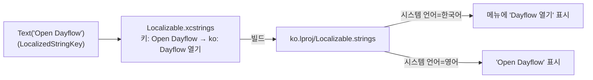
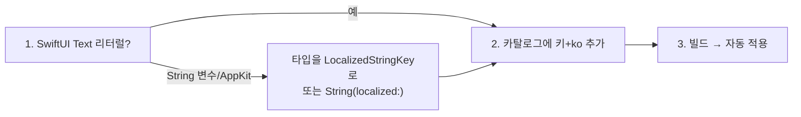

# 11. 다국어 / 한글 (Localization)

> **이 문서에서 다루는 것**: Dayflow에 다국어(i18n) 지원을 어떻게 넣었는지, 한글이 어떻게
> 동작하는지, 그리고 **새 문자열·새 언어를 추가하는 방법**.
>
> **선행 지식**: [01. 아키텍처](01-architecture.md), [07. UI 계층](07-ui-layer.md)

---

## 1. 채택한 방식: String Catalog

| 결정 | 값 |
|------|-----|
| 방식 | **String Catalog (`Localizable.xcstrings`)** — Xcode 15+ 표준 |
| 언어 선택 | **시스템 언어 따름** (앱 내 선택 UI 없음) |
| 범위 | **단계적** — 인프라 + 메뉴바부터, 나머지는 동일 패턴 확장 |

> 💡 **String Catalog이 뭐야?** 모든 언어의 번역을 JSON 파일 하나(`*.xcstrings`)로 관리하는
> Xcode 기능. SwiftUI `Text("...")`와 자동 연동되고, 빌드 시 언어별 `.lproj/Localizable.strings`로
> 컴파일됩니다.

> ⚠️ **UI 번역과 LLM 출력 언어는 별개**입니다. AI가 만드는 카드 내용의 언어는
> [LLMOutputLanguagePreferences.swift](../Dayflow/Dayflow/Core/AI/LLMOutputLanguagePreferences.swift)가
> 따로 관리합니다([05편](05-ai-llm.md)). 이 문서는 **앱 UI 텍스트**만 다룹니다.

---

## 2. 동작 원리



핵심: **SwiftUI `Text("영어문구")`는 자동으로 `LocalizedStringKey`가 됩니다.** 그래서 카탈로그에
그 영어문구를 키로 한 한글 값만 넣으면 **코드 수정 없이** 번역됩니다.

> 💡 단, `Text(someStringVariable)`나 `let title: String` 같은 **String 타입**은 자동 번역이
> 안 됩니다. 이 경우 타입을 `LocalizedStringKey`로 바꾸거나 `String(localized:)`를 써야 합니다.

---

## 3. 변경된 파일 (인프라)

| 파일 | 변경 |
|------|------|
| [Dayflow.xcodeproj/project.pbxproj](../Dayflow/Dayflow.xcodeproj/project.pbxproj) | `knownRegions`에 `ko` 추가 |
| [Info.plist](../Dayflow/Dayflow/Info.plist) | `CFBundleLocalizations`(en, ko), `CFBundleAllowMixedLocalizations`, `CFBundleDevelopmentRegion` |
| [Localizable.xcstrings](../Dayflow/Dayflow/Localizable.xcstrings) | **신규** String Catalog (en source + ko) |
| [Menu/StatusMenuView.swift](../Dayflow/Dayflow/Menu/StatusMenuView.swift) | `MenuRow.title`, `DurationOption.label`을 `String` → `LocalizedStringKey` |

> 📦 이 프로젝트는 Xcode 16 **동기화 그룹**(`PBXFileSystemSynchronizedRootGroup`)을 씁니다.
> 그래서 `Dayflow/Dayflow/` 폴더에 `.xcstrings`를 두면 **pbxproj 수정 없이 자동 포함**됩니다.

---

## 4. 한글화 완료 surface (검증 완료)

빌드 후 `Dayflow.app/Contents/Resources/ko.lproj/Localizable.strings`에 컴파일됨을 모두 확인 ✅.

### 4-1. 메뉴바 ([StatusMenuView](../Dayflow/Dayflow/Menu/StatusMenuView.swift))
| 영어 | 한글 |
|------|------|
| Open Dayflow | Dayflow 열기 |
| Open Recordings | 녹화 폴더 열기 |
| Check for Updates | 업데이트 확인 |
| Quit Completely | 완전히 종료 |
| Pause Dayflow / Resume Dayflow | Dayflow 일시정지 / Dayflow 재개 |
| 15 Min / 30 Min / 1 Hour | 15분 / 30분 / 1시간 |

### 4-2. 기능 잠금 화면 (Daily / Weekly / Chat)
[DailyAccessLockedViews.swift](../Dayflow/Dayflow/Views/UI/DailyAccessLockedViews.swift),
[WeeklyAccessLockedView.swift](../Dayflow/Dayflow/Views/UI/Weekly/WeeklyAccessLockedView.swift),
[ChatView+Content.swift](../Dayflow/Dayflow/Views/UI/ChatView+Content.swift) — 18개 문자열 번역.
| 영어 | 한글 |
|------|------|
| Unlock Daily / Weekly / Beta | Daily / Weekly / 베타 잠금 해제 |
| Weekly unlocks after 30 hours of recorded timeline data | 기록된 타임라인 데이터가 30시간 쌓이면 Weekly가 열립니다 |
| Turn on notifications to unlock Daily | 알림을 켜서 Daily 잠금 해제 |
| Ask about your Dayflow data | Dayflow 데이터에 대해 물어보세요 |

> 💡 잠금 화면 문구는 모두 SwiftUI `Text("...")` 리터럴이라 **코드 수정 없이** 카탈로그에
> ko 값만 추가했습니다. 기능 언락 기준은 [08편](08-onboarding-access.md) 참고.

---

## 4-3. ⚡ Xcode가 전체 문자열을 자동 추출함

Xcode에서 한 번 빌드하면 String Catalog가 코드의 모든 `Text` 리터럴을 스캔해
`Localizable.xcstrings`에 **자동 등록**합니다(현재 ~448개 키, 대부분 미번역 상태).

→ 이제 새 문자열 번역은 **키 추가가 아니라 ko 값만 채우면** 됩니다. 대량 번역 시 아래
스크립트 패턴이 안전합니다(거대 JSON 수작업 ❌):

```python
import json
d = json.load(open("Localizable.xcstrings"))
ko = { "Unlock Daily": "Daily 잠금 해제", ... }   # 영어키 → 한글
for k, v in ko.items():
    if k in d["strings"]:
        d["strings"][k].setdefault("localizations", {})["ko"] = \
            {"stringUnit": {"state": "translated", "value": v}}
json.dump(d, open("Localizable.xcstrings", "w"), ensure_ascii=False, indent=2)
```

---

## 5. 레시피: 새 문자열 번역하기



1. **자동 케이스**: `Text("Some text")` 그대로 두고, `Localizable.xcstrings`에 항목 추가:
   ```json
   "Some text" : {
     "localizations" : {
       "ko" : { "stringUnit" : { "state" : "translated", "value" : "어떤 문구" } }
     }
   }
   ```
2. **String 케이스**: 프로퍼티가 `String`이면 `LocalizedStringKey`로 바꾸거나, 코드에서
   `String(localized: "Some text")`로 조회.
3. Xcode에서 카탈로그 GUI로 편집해도 되고(권장), JSON을 직접 손봐도 됨.

> 💡 Xcode에서 빌드하면 코드의 모든 `Text` 리터럴을 자동 스캔해 카탈로그에 "미번역" 항목으로
> 채워줍니다. 그 후 ko 칸만 채우면 됩니다.

---

## 6. 레시피: 새 언어 추가하기 (예: 일본어)

1. `project.pbxproj`의 `knownRegions`에 `ja` 추가.
2. `Info.plist`의 `CFBundleLocalizations` 배열에 `ja` 추가.
3. `Localizable.xcstrings`의 각 항목에 `"ja"` stringUnit 추가(또는 Xcode 카탈로그에서 언어 추가 버튼).
4. 빌드 → `ja.lproj` 자동 생성.

---

## 7. 다음 확장 대상 (TODO)

같은 패턴으로 넓혀갈 핵심 화면(문자열 ~370개+):
- [x] **전체 앱 일괄 번역 완료** — 자동 추출된 448키 중 의미 있는 **~399키** 한글화 (빌드 검증)
  - 메뉴바 · 잠금화면 · 온보딩 · 설정 · 타임라인/카드 · 채팅 · 주간 · 목표/저널 포함
  - 영어 유지: 브랜드(Dayflow, LM Studio, Ollama, Pro), 플레이스홀더(이메일/키 예시), 차트 축 라벨(N/X/Y/Z), 순수 숫자·기호·포맷 토큰
- [ ] 신규 문자열 추가 시 §4-3 스크립트로 ko 채우기 (지속 관리)
- [ ] 번역 품질 검수(맥락/존댓말 톤 일관성) — 네이티브 리뷰 권장

> ⚠️ **보간 문자열 주의**: "Dayflow paused for {시간}"처럼 변수가 섞인 문구는 언어마다 어순이
> 달라집니다. `Text("... \(value)")` 형태로 두면 카탈로그가 `%@` 플레이스홀더로 처리하니,
> 문장 전체를 하나의 키로 만들어 번역하세요(단어 조각을 따로 번역 ❌).

---

## 다음 편 예고
시리즈 끝. 처음으로 → [README](README.md). 막히면 [10. 레시피 & FAQ](10-recipes-faq.md)와
[용어집](glossary.md).
