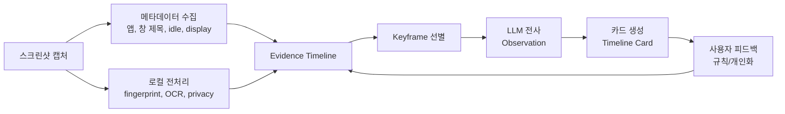
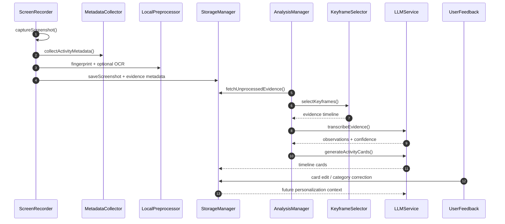

# 12. 스크린샷 분석 고도화 전략

> 작성자: JunyoungJung  
> 작성일: 2026-06-08
>
> **이 문서에서 다루는 것**: 스크린샷 기반 분석은 유지하면서 성능, 정확도, 기능성을 함께 높이는
> 개선 전략. 단순히 "더 적게 캡처"하는 것이 아니라, LLM이 더 좋은 근거를 보도록 파이프라인을
> 재설계하는 방향을 정리합니다.
>
> **선행 지식**: [02. 데이터 파이프라인](02-data-pipeline.md), [03. 화면 캡처](03-recording-capture.md),
> [05. AI / LLM](05-ai-llm.md)

핵심 파일:
- [Core/Recording/ScreenRecorder.swift](../Dayflow/Dayflow/Core/Recording/ScreenRecorder.swift)
- [Core/Recording/StorageManager+Screenshots.swift](../Dayflow/Dayflow/Core/Recording/StorageManager+Screenshots.swift)
- [Core/Analysis/AnalysisManager.swift](../Dayflow/Dayflow/Core/Analysis/AnalysisManager.swift)
- [Core/AI/LLMService.swift](../Dayflow/Dayflow/Core/AI/LLMService.swift)

---

## 1. 결론

Dayflow는 스크린샷을 버릴 필요가 없습니다. 오히려 스크린샷은 가장 범용적인 근거입니다. 다만
현재 구조는 스크린샷이 거의 단독 근거로 쓰이기 때문에 비용, 지연, 오분류가 같이 생깁니다.

추천 방향은 **스크린샷 + 구조화된 활동 신호 + 선택적 고정밀 분석**입니다.



핵심은 LLM에게 "이미지 몇 장"만 주는 것이 아니라, 다음처럼 근거를 묶어서 주는 것입니다.

```text
10:30:00  VS Code / SidebarView.swift / Dayflow repo / idle 0s / OCR: "PausePillView..."
10:30:10  거의 동일 화면 / typing 추정 / idle 0s
10:30:20  Chrome / docs.swift.org / URL 있음 / OCR: "ScreenCaptureKit..."
```

---

## 2. 현재 구조의 강점과 한계

### 강점

- 어떤 앱이든 화면만 보이면 분석할 수 있습니다.
- ScreenCaptureKit 기반이라 macOS 권한 모델과 잘 맞습니다.
- `RecordingPrivacyPreferences`로 민감 앱을 placeholder 처리할 수 있습니다.
- Gemini, Dayflow Backend, Ollama, Chat CLI 등 provider 교체가 가능합니다.

### 한계

| 문제 | 원인 | 결과 |
|------|------|------|
| 반복 화면 비용 | 10초마다 유사한 이미지가 계속 저장/분석됨 | 저장량, 영상 합성, LLM 비용 증가 |
| 앱/파일명 오판 | LLM이 이미지에서 작은 텍스트를 읽어야 함 | VS Code/Cursor/Xcode 혼동 |
| 맥락 부족 | 현재 화면만 보고 "왜" 하는지 판단 | 같은 작업이 여러 카드로 쪼개짐 |
| 민감 정보 리스크 | 이미지에 텍스트가 그대로 들어감 | provider 전송 시 부담 |
| 재처리 비효율 | 실패한 구간을 같은 방식으로 반복 | 동일 오류 재발 가능 |

---

## 3. 개선 원칙

1. **원본 스크린샷은 유지한다**
   - 타임랩스, 재분석, 사용자 확인에 필요합니다.

2. **LLM 입력은 선별한다**
   - 모든 프레임을 같은 중요도로 보내지 않습니다.
   - 앱 전환, 창 제목 변화, OCR 변화, 이미지 변화가 큰 프레임을 우선합니다.

3. **이미지보다 구조화된 근거를 먼저 준다**
   - active app, window title, URL, idle, OCR은 LLM 추측을 줄입니다.

4. **불확실한 구간만 더 비싸게 분석한다**
   - confidence가 낮을 때만 고해상도 프레임, 더 많은 keyframe, 재시도를 사용합니다.

5. **사용자 수정은 다음 분석의 입력이 된다**
   - 카드 제목/카테고리 수정은 개인화 규칙으로 축적합니다.

---

## 4. 목표 파이프라인



의사코드:

```swift
func captureCycle() async throws {
  let screenshot = try await captureScreenshot()
  let metadata = ActivityMetadataCollector.collect()
  let fingerprint = ScreenshotFingerprint.compute(from: screenshot)
  let ocrText = OCRPolicy.shouldRun(metadata, fingerprint)
    ? LocalOCR.extractText(from: screenshot)
    : nil

  let evidence = ScreenshotEvidence(
    imageURL: screenshot.url,
    capturedAt: screenshot.capturedAt,
    metadata: metadata,
    fingerprint: fingerprint,
    ocrText: ocrText,
    duplicateOfPrevious: fingerprint.isNearDuplicate(of: previousFingerprint)
  )

  try StorageManager.shared.saveEvidence(evidence)
}

func analyzeBatch(_ batchId: Int64) async throws {
  let evidenceItems = StorageManager.shared.evidenceForBatch(batchId)
  let keyframes = KeyframeSelector.select(from: evidenceItems)
  let confidenceHint = ConfidenceEstimator.estimate(from: keyframes)

  let observations = try await LLMService.shared.transcribeEvidence(
    keyframes,
    confidenceHint: confidenceHint
  )

  let cards = try await LLMService.shared.generateActivityCards(
    observations,
    context: buildPersonalizedContext()
  )

  try StorageManager.shared.replaceTimelineCards(cards)
}
```

---

## 5. 정확도 개선

### 5-1. 활동 메타데이터 저장

스크린샷 한 장마다 다음 정보를 함께 저장합니다.

| 필드 | 예시 | 효과 |
|------|------|------|
| `active_app_name` | `Visual Studio Code` | 앱명 오판 감소 |
| `bundle_id` | `com.microsoft.VSCode` | 앱 식별 안정화 |
| `window_title` | `SidebarView.swift - Dayflow` | 파일/문서 맥락 보강 |
| `display_id` | `1` | 멀티 모니터 분석 개선 |
| `idle_seconds_at_capture` | `0` | 자리비움/정지 구간 판단 |
| `privacy_state` | `normal/redacted` | 민감 구간 처리 |
| `visible_text_hash` | OCR 텍스트 해시 | 변화 감지 |

확장 후보:
- 브라우저 URL/title
- IDE 프로젝트 경로
- Git repo 이름과 branch
- 캘린더 회의 여부

### 5-2. OCR 전처리

macOS Vision OCR을 사용해 화면 텍스트를 로컬에서 먼저 추출합니다.

장점:
- 작은 텍스트를 LLM이 이미지에서 직접 읽는 부담 감소
- 개인정보 마스킹 후 provider 전송 가능
- 이미지 없이도 일부 observation 생성 가능

주의:
- OCR은 레이아웃/의도를 모릅니다.
- OCR 결과는 "보조 근거"로 쓰고, 최종 판단은 이미지/메타데이터와 함께 해야 합니다.

### 5-3. Confidence 모델

Observation과 card에 신뢰도를 둡니다.

```text
high:
  앱명 + 창 제목 + OCR + 이미지 변화가 모두 일관됨

medium:
  앱명/창 제목은 있으나 OCR이 부족하거나 이미지 변화가 작음

low:
  이미지가 흐림, 앱명 불명확, OCR 없음, 화면 변화가 적음
```

UI에서는 낮은 confidence 카드에만 리뷰 유도나 재분석 버튼을 보여줄 수 있습니다.

---

## 6. 성능 개선

### 6-1. 중복 화면 감지

원본 파일은 유지하더라도, 분석 입력에서는 near-duplicate를 줄입니다.

판단 기준:
- downscaled grayscale diff
- average hash 또는 perceptual hash
- OCR 텍스트 변화량
- active app/window title 변화

정책:

```text
앱/창 제목 동일 + 이미지 diff 작음 + OCR 변화 작음
→ duplicate frame으로 표시
→ LLM 입력에서는 생략하거나 "same screen continued"로 압축
```

### 6-2. Keyframe 선별

LLM에 보낼 프레임을 다음 우선순위로 고릅니다.

1. 배치의 첫 프레임과 마지막 프레임
2. active app이 바뀐 시점
3. window title이 바뀐 시점
4. OCR 텍스트가 크게 바뀐 시점
5. 이미지 diff가 큰 시점
6. 긴 idle 전후 프레임

### 6-3. 분석 스케줄 조절

캡처는 유지하되 LLM 분석은 상황에 따라 지연합니다.

| 조건 | 처리 |
|------|------|
| CPU 높음 | 분석 지연 |
| 배터리 낮음 | 로컬 전처리만 수행 |
| 사용자가 활발히 입력 중 | 캡처만 하고 분석은 뒤로 이동 |
| 앱 종료 직전 | WAL checkpoint와 최소 상태 저장 |

---

## 7. 기능 추가

### 7-1. 카드 리뷰 기능 강화

기능:
- 낮은 confidence 카드만 필터링
- 카드 병합/분할 추천
- "이 시간대 다시 분석" 버튼
- 잘못된 카테고리 빠른 수정

효과:
- 사용자가 모든 카드를 볼 필요가 없습니다.
- 수정 데이터가 다음 분석 정확도를 높입니다.

### 7-2. 개인화 규칙

사용자 수정에서 규칙을 추출합니다.

예시:

```text
bundle_id = com.microsoft.VSCode + repo contains Dayflow
→ category = Development

domain = docs.swift.org
→ category = Research

window_title contains "Linear"
→ category = Product / Planning
```

규칙은 LLM 프롬프트 앞단의 context로 넣거나, LLM 호출 전 deterministic 분류에 사용할 수 있습니다.

### 7-3. 개발 작업 특화 분석

Dayflow 사용자가 개발자라면 다음 신호의 ROI가 큽니다.

- 현재 Git repo
- branch 이름
- 최근 modified files
- IDE window title
- 터미널 working directory
- 최근 git diff 요약

예시 카드 품질:

```text
나쁨: "코드를 작성했다"
좋음: "Dayflow의 SidebarView와 PausePillView를 보며 녹화 상태 UI를 점검했다"
```

---

## 8. 데이터 모델 제안

기존 `screenshots` 테이블을 확장하거나 별도 `screenshot_evidence` 테이블을 둡니다.

```sql
CREATE TABLE screenshot_evidence (
  screenshot_id INTEGER PRIMARY KEY REFERENCES screenshots(id) ON DELETE CASCADE,
  active_app_name TEXT,
  bundle_id TEXT,
  window_title TEXT,
  display_id INTEGER,
  image_hash TEXT,
  visible_text TEXT,
  visible_text_hash TEXT,
  is_near_duplicate INTEGER NOT NULL DEFAULT 0,
  confidence_hint TEXT,
  created_at INTEGER NOT NULL
);
```

카드 쪽에는 분석 품질 추적 필드를 추가할 수 있습니다.

```sql
ALTER TABLE timeline_cards ADD COLUMN confidence REAL;
ALTER TABLE timeline_cards ADD COLUMN source_summary TEXT;
ALTER TABLE timeline_cards ADD COLUMN needs_review INTEGER NOT NULL DEFAULT 0;
```

---

## 9. 단계별 적용안

### Phase 1. 저위험 개선

- 캡처 시 active app, bundle id, window title 저장
- keyframe selector 추가
- LLM 프롬프트에 metadata timeline 추가
- 중복 화면은 LLM 입력에서 압축

기대 효과:
- 비용과 지연 감소
- 앱/파일명 정확도 상승
- 기존 저장/분석 구조 유지

### Phase 2. 정확도 강화

- Vision OCR 추가
- confidence 계산
- 낮은 confidence 카드 리뷰 UI
- 사용자 카테고리 수정 로그 저장

기대 효과:
- 카드 품질 안정화
- 재분석 우선순위 판단 가능
- 개인화 기반 마련

### Phase 3. 기능 확장

- 브라우저 URL/title 수집
- 개발 작업 신호 수집
- 개인화 규칙 엔진
- 실패 구간만 부분 재처리

기대 효과:
- "무슨 앱을 썼는지"에서 "어떤 목표를 수행했는지"로 분석 수준 상승
- 장기적으로 사용자별 정확도 개선

---

## 10. 검증 지표

| 지표 | 목표 |
|------|------|
| LLM 입력 프레임 수 | 기존 대비 40~70% 감소 |
| batch 처리 시간 | 기존 대비 30% 이상 감소 |
| 사용자가 수정한 카드 비율 | 감소 |
| 낮은 confidence 카드 비율 | 감소 |
| 앱명/파일명 오판율 | 감소 |
| 재분석 성공률 | 증가 |
| 저장 용량 증가 | metadata 추가분만 허용 |

검증 방법:
- 동일한 하루 데이터를 기존 파이프라인과 개선 파이프라인으로 재처리
- card title/category/summary 변경량 비교
- 사용자가 직접 "맞음/틀림"으로 샘플 평가
- `llm_calls`와 batch timing 로그 비교

---

## 11. 엣지케이스 체크리스트

### 11-1. 배치와 시간 경계

| 엣지케이스 | 위험 | 대응 |
|------------|------|------|
| 목표 길이보다 짧은 최신 배치 | 현재 `createScreenshotBatches()`는 마지막 배치가 15분보다 짧으면 분석하지 않습니다. keyframe/evidence 로직이 이 배치를 억지로 처리하면 기존 정책과 달라집니다. | incomplete batch는 기존처럼 보류하고, UI에는 "분석 대기" 상태만 보여줍니다. |
| 5분 미만 배치 | `queueLLMRequest()`는 5분 미만을 `skipped_short`로 처리합니다. | 짧은 배치는 observation/card를 만들지 않거나 인접 배치 병합 정책을 명시합니다. |
| 스크린샷 간 2분 초과 gap | sleep, pause, 권한 손실, 앱 종료 때문에 배치가 분리됩니다. | gap은 카드에서 메우지 말고 실제 공백으로 유지합니다. |
| 자정/4AM logical day 경계 | 카드 날짜와 UI 날짜가 어긋날 수 있습니다. | 기존 `getDayInfoFor4AMBoundary()` 기준을 evidence/card 저장에도 동일하게 적용합니다. |
| 카드 lookback 45분 교체 범위 | `LLMService`는 최근 45분 카드와 observation을 다시 병합하고 `replaceTimelineCardsInRange()`로 교체합니다. 잘못된 keyframe 때문에 기존 좋은 카드가 사라질 수 있습니다. | 새 카드 검증 실패 시 기존 카드를 유지하고, replacement는 atomic하게 처리합니다. |

### 11-2. Privacy / Redaction

| 엣지케이스 | 위험 | 대응 |
|------------|------|------|
| 차단 앱이 frontmost인 상태 | 이미지는 placeholder로 저장되지만, 새 metadata/OCR 수집이 window title이나 텍스트를 새로 유출할 수 있습니다. | privacy 판단을 가장 먼저 실행하고, blocked 상태면 OCR/window title/URL 저장을 생략하거나 redacted 값만 저장합니다. |
| 차단 앱이 background에 열려 있음 | `SCContentFilter`는 차단 앱을 제외하지만 metadata collector가 frontmost 외 앱을 훑으면 민감 정보가 섞일 수 있습니다. | 기본 metadata는 frontmost 앱 기준으로 제한합니다. |
| 브라우저 URL 수집 | URL에는 토큰, 검색어, 문서 ID, 이메일 주소가 포함될 수 있습니다. | host/path/query를 분리 저장하고 query는 기본 redaction합니다. |
| OCR 텍스트 저장 | OCR은 화면의 개인정보를 그대로 텍스트화합니다. 이미지보다 검색/로그 유출 위험이 큽니다. | OCR 원문 저장은 opt-in 또는 로컬 전용으로 제한하고, provider 전송 전 masking을 적용합니다. |
| LLM/debug 로그 | metadata timeline이 `llm_calls`에 저장되면 민감 텍스트가 장기 보관됩니다. | LLMLogger redaction 대상에 URL, OCR, window title을 추가합니다. |

### 11-3. Keyframe / Duplicate Detection

| 엣지케이스 | 위험 | 대응 |
|------------|------|------|
| 코딩 화면처럼 변화가 작지만 의미가 큰 작업 | 이미지 diff가 작아 duplicate로 분류되면 실제 작업 시간이 누락됩니다. | idle seconds, window title, git diff, keyboard activity 같은 보조 신호를 함께 봅니다. |
| 문서 읽기/영상 시청 | 화면 변화가 작아도 사용자는 집중 중일 수 있습니다. | idle만으로 "무활동" 처리하지 말고 active app/category를 함께 판단합니다. |
| 빠른 앱 전환 | 10초 간격 사이의 짧은 전환은 스크린샷에 잡히지 않을 수 있습니다. | 앱 전환 이벤트는 캡처와 별도 이벤트 로그로 저장합니다. |
| 첫/마지막 프레임 누락 | LLM timestamp가 배치 전체를 덮지 못하고 validation 실패가 납니다. | keyframe selector는 항상 첫 프레임과 마지막 프레임을 포함합니다. |
| provider별 입력 방식 차이 | Gemini는 압축 mp4, Dayflow Backend는 base64 이미지, Chat CLI/Ollama는 샘플 이미지라 같은 keyframe 수가 다른 품질을 냅니다. | provider별 keyframe budget을 따로 둡니다. |
| duplicate 압축 후 시간 계산 | "same screen continued"가 실제 시간을 충분히 표현하지 않으면 카드 길이가 왜곡됩니다. | 생략된 구간은 duration metadata로 LLM에 명시합니다. |

### 11-4. OCR / Metadata 품질

| 엣지케이스 | 위험 | 대응 |
|------------|------|------|
| 작은 글자, 코드, 다국어 | OCR이 틀린 텍스트를 만들고 LLM이 이를 사실로 믿을 수 있습니다. | OCR confidence와 언어를 함께 저장하고 낮은 confidence는 보조 근거로만 사용합니다. |
| window title이 부정확함 | Electron 앱, 브라우저, IDE는 title이 늦게 갱신되거나 탭 이름만 보일 수 있습니다. | screenshot timestamp와 metadata timestamp를 함께 저장하고 stale 여부를 표시합니다. |
| active display 기준 오류 | `ActiveDisplayTracker`는 마우스 위치 기준이며 느리게 polling합니다. 키보드 포커스가 다른 모니터에 있을 수 있습니다. | display id는 "추정"으로 저장하고 frontmost window/display 신호를 별도로 보강합니다. |
| 브라우저 확장/권한 없음 | URL 수집이 일부 브라우저에서 실패합니다. | URL 없음은 실패가 아니라 `unknown`으로 처리하고 이미지/OCR fallback을 유지합니다. |

### 11-5. 사용자 피드백 / 개인화

| 엣지케이스 | 위험 | 대응 |
|------------|------|------|
| 사용자가 한 번 잘못 수정함 | 개인화 규칙이 오분류를 고착할 수 있습니다. | 단일 수정으로 hard rule을 만들지 말고 반복 패턴에서 confidence를 올립니다. |
| 같은 앱의 용도가 다양함 | Chrome, Slack, Notion은 업무/휴식/조사에 모두 쓰입니다. | 앱 단독 규칙보다 URL, title, 시간대, 이전 카드 맥락을 함께 봅니다. |
| 카테고리 이름 변경 | 과거 규칙이 새 카테고리 체계와 어긋납니다. | 규칙은 category id 또는 normalized descriptor 기준으로 저장합니다. |

### 11-6. 저장소 / 마이그레이션

| 엣지케이스 | 위험 | 대응 |
|------------|------|------|
| 기존 screenshot 행에는 evidence가 없음 | 새 분석 로직이 metadata를 필수로 보면 과거 데이터 재처리가 깨집니다. | evidence 필드는 nullable로 두고 없는 경우 기존 이미지 기반 분석으로 fallback합니다. |
| 파일은 삭제됐지만 DB 행은 남음 | keyframe/OCR 단계에서 파일 로드 실패가 납니다. | `is_deleted`, file existence, evidence 존재 여부를 모두 검사합니다. |
| evidence 테이블과 screenshot 삭제 불일치 | 저장소가 커지거나 orphan row가 생깁니다. | `ON DELETE CASCADE`와 maintenance cleanup을 같이 둡니다. |
| OCR 원문 저장 용량 증가 | 텍스트가 길면 DB 크기와 WAL checkpoint 비용이 커집니다. | 원문 길이 제한, hash 우선 저장, 필요 시 별도 압축 저장을 적용합니다. |

---

## 12. 주의할 점

- OCR과 메타데이터는 개인정보가 될 수 있으므로 privacy 설정과 함께 설계해야 합니다.
- keyframe을 너무 줄이면 짧은 작업 전환을 놓칠 수 있습니다.
- 개인화 규칙은 LLM보다 앞에서 강제하면 오분류가 고착될 수 있습니다.
- provider별 입력 방식이 다르므로 공통 타입은 `EvidenceFrame`처럼 추상화해야 합니다.
- 기능 추가보다 먼저 "같은 입력에서 더 좋은 카드가 나오는지"를 측정해야 합니다.

---

## 다음 편 추천

- 구현을 시작한다면 [04. 저장소 / GRDB](04-storage-grdb.md)에서 마이그레이션 구조를 먼저 확인하세요.
- provider 프롬프트를 바꿀 때는 [05. AI / LLM](05-ai-llm.md)의 검증/재시도 흐름을 같이 봐야 합니다.
