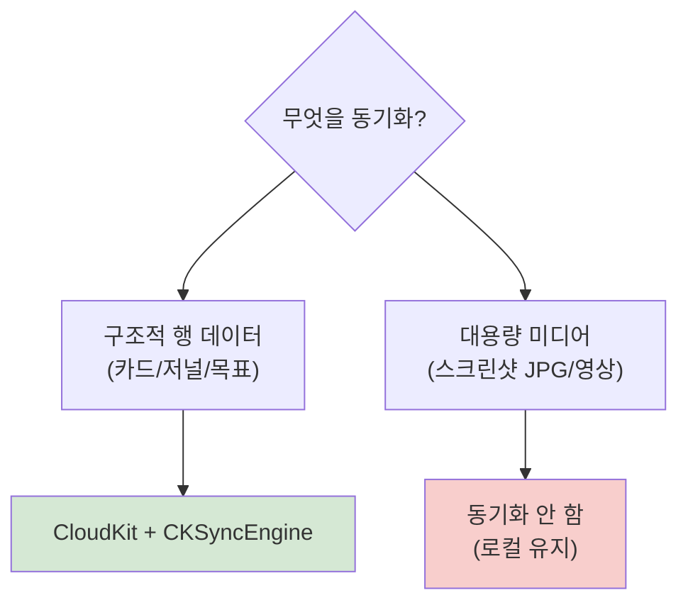
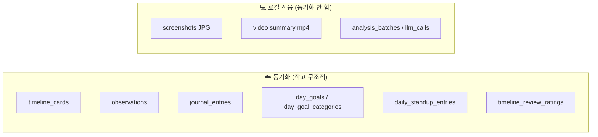
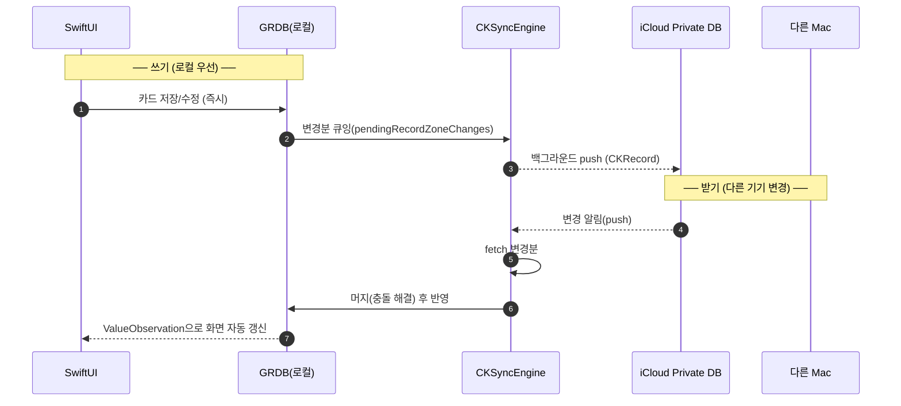
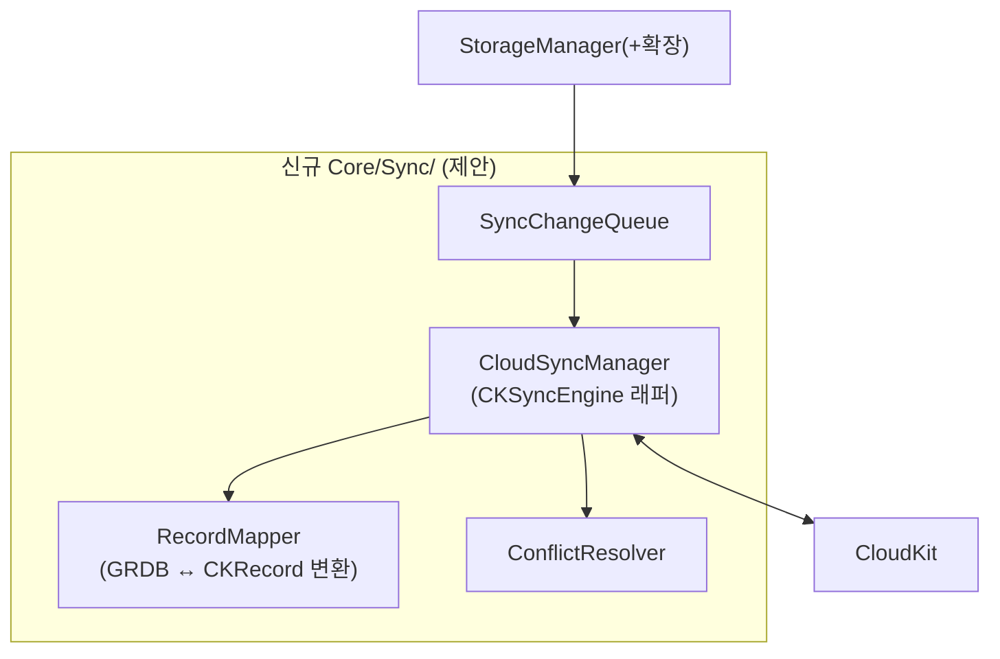
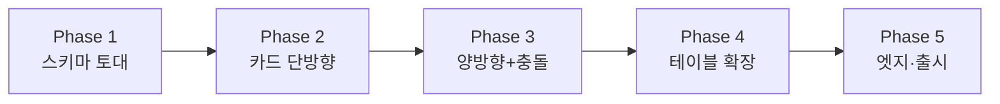
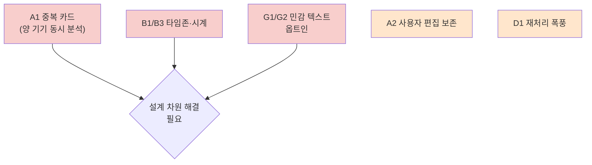
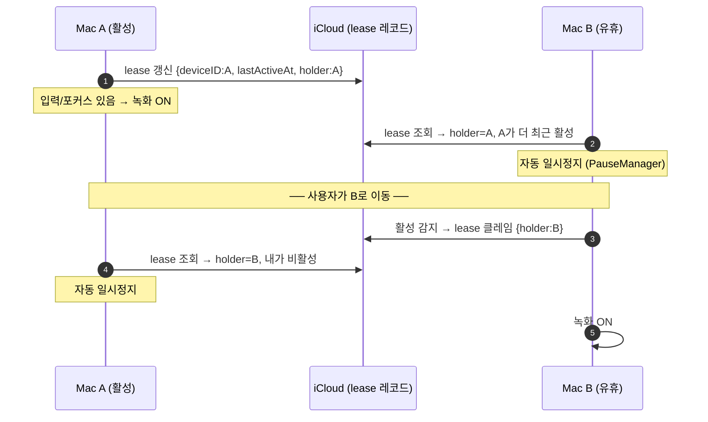
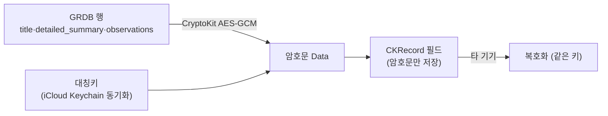
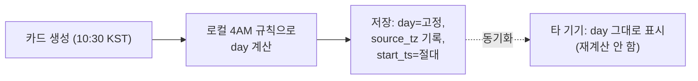

# 13. CloudKit 동기화 설계 (멀티 디바이스)

> **이 문서에서 다루는 것**: 여러 Mac에서 같은 Dayflow 타임라인을 보기 위한 iCloud(CloudKit)
> 동기화 **설계안**. 아직 구현 전 단계의 청사진입니다.
>
> **선행 지식**: [04. 저장소/GRDB](04-storage-grdb.md), [08. 기능 언락](08-onboarding-access.md), [09. 시스템](09-system-release.md)
>
> ⚠️ 이 문서는 **제안(Proposal)**입니다. 현재 코드에는 동기화 기능이 **없습니다**.

---

## 1. 왜 어려운가 (한 줄 요약)

Dayflow는 **GRDB(직접 만든 SQLite 계층)**를 씁니다. 그래서 Core Data/SwiftData가 제공하는
**자동 CloudKit 미러링(`NSPersistentCloudKitContainer`)을 공짜로 쓸 수 없습니다.** → 동기화 계층을
**직접 만들어야** 합니다.

> 💡 **CloudKit**: Apple의 iCloud 기반 구조적 데이터 동기화 프레임워크. 사용자의 iCloud
> Private DB에 레코드를 저장/동기화. [용어집](glossary.md) 참고.

---

## 2. 동기화 기술 선택



| 후보 | 판정 | 이유 |
|------|------|------|
| **CKSyncEngine** (macOS 14+, WWDC23) | ✅ **채택** | GRDB 같은 커스텀 persistence에 권장. 변경 추적·재시도·델타 동기화 자동. **최소 타깃 macOS 14와 일치** |
| SwiftData/Core Data + CloudKit | ❌ | DB 엔진을 통째로 갈아엎어야 함(대규모 리라이트) |
| iCloud Drive로 `chunks.sqlite` 통째 업로드 | ❌ **금지** | SQLite를 파일 동기화하면 **손상·머지 불가**. 안티패턴 |
| 기존 Dayflow Backend 확장 | △ 대안 | 자체 서버 동기화. Pro 차별화와 결합 가능하나 서버 개발 부담 |

---

## 3. ⚠️ 무엇을 동기화하나 — 가장 중요한 결정



| 데이터 | 동기화 | 이유 |
|--------|--------|------|
| `timeline_cards`, `observations`, `journal_entries`, `day_goals`, `daily_standup_entries`, `timeline_review_ratings` | ✅ | 작고 구조적, 멀티 디바이스 가치 큼 |
| 스크린샷 JPG · 비디오 요약 | ❌ | 용량 폭발(iCloud 비용) + **프라이버시 철학 위배**(로컬 전용이 Dayflow 셀링포인트) |
| `analysis_batches`, `batch_screenshots`, `llm_calls`, `chunks` | ❌ | 기기별 처리 상태/로그. 동기화 무의미 |

> 💡 결과: **각 기기가 화면을 따로 캡처·분석하되, "완성된 타임라인 결과물"만 클라우드로 공유.**
> B Mac에서 A Mac의 카드를 보지만, 원본 스크린샷은 각자 기기에만 남음.
> `video_summary_url`은 로컬 경로라 동기화해도 다른 기기에선 깨짐 → 동기화 제외 또는 nil 처리.

---

## 4. 🔑 스키마 변경 — 동기화의 토대

CloudKit 동기화는 **기기 간 안정적인 고유 키 + 변경 시각 + 삭제 추적**이 필수입니다.
현재 스키마를 점검하면:

| 테이블 | 현재 PK | 동기화 적합성 | 조치 |
|--------|---------|---------------|------|
| `timeline_cards` | `id INTEGER AUTOINCREMENT` | ❌ **위험** — AUTOINCREMENT는 기기마다 다른 값 → 충돌 | **`uuid TEXT` 컬럼 추가**해 레코드 키로 사용 |
| `journal_entries` | `id` + `day UNIQUE`, `updated_at` 있음 | ✅ 양호 | `day`를 자연키로 사용 |
| `daily_standup_entries` | `standup_day` PK, `updated_at` | ✅ 좋음 | `standup_day` 자연키 |
| `day_goals` | `day` PK, `updated_at` | ✅ 좋음 | `day` 자연키 |
| `observations` | `id AUTOINCREMENT` | ❌ | `uuid` 추가 |

> 💡 **왜 AUTOINCREMENT가 문제?** A Mac에서 `id=5` 카드를 만들고 B Mac에서도 `id=5` 카드를
> 만들면 서로 다른 데이터인데 같은 키 → 동기화 시 덮어씀(데이터 손실). 그래서 기기와 무관하게
> 고유한 **UUID**가 필요.

**추가할 공통 컬럼** (동기화 테이블 전부):
```sql
ALTER TABLE timeline_cards ADD COLUMN uuid TEXT;           -- 기기 무관 고유 키
ALTER TABLE timeline_cards ADD COLUMN updated_at INTEGER;  -- 충돌 해결용 (Unix ts)
ALTER TABLE timeline_cards ADD COLUMN deleted_at INTEGER;  -- tombstone(삭제 추적)
ALTER TABLE timeline_cards ADD COLUMN ck_system_fields BLOB; -- CKRecord 메타(변경 토큰)
```
- 기존 행은 마이그레이션 시 `uuid = UUID()` 백필.
- ⚠️ 마이그레이션 안전 규칙은 [04편 §4](04-storage-grdb.md) + `database-migration` 준수. NULL 허용/기본값 필수.
- 삭제는 즉시 DELETE 대신 **tombstone(`deleted_at` 세팅)** → 다른 기기에 삭제 전파 후 정리.

---

## 5. 동기화 흐름 (오프라인 우선)

**원칙: 항상 로컬 GRDB에 먼저 쓰고, 동기화는 백그라운드 큐로.** (네트워크 실패해도 앱은 동작)



- 쓰기 경로: [StorageManager+TimelineCards.swift](../Dayflow/Dayflow/Core/Recording/StorageManager+TimelineCards.swift) 등의 INSERT/UPDATE 직후 sync 큐에 등록.
- 읽기/화면 갱신: GRDB `ValueObservation`(이미 사용 중)이라 머지된 변경이 자동으로 UI에 반영.

---

## 6. 충돌 해결 정책

두 기기가 같은 데이터를 동시에 수정하면 충돌. 테이블 성격별로:

| 데이터 | 정책 | 근거 |
|--------|------|------|
| `timeline_cards` (AI 생성) | **Last-Writer-Wins** (`updated_at` 큰 쪽) | AI 재생성물, 사소한 덮어쓰기 허용 |
| `journal_entries` (사용자 글) | **필드 머지** / 최신 우선 + 경고 | 사용자 수기 입력은 손실 민감 |
| `day_goals`, `daily_standup` | Last-Writer-Wins | day 단위 단순 상태 |
| `timeline_review_ratings` | Last-Writer-Wins | 단순 평점 |

> 💡 같은 `day`/`uuid`에 대한 두 버전을 비교해 `updated_at`이 최신인 쪽 채택. 저널처럼 민감한
> 건 필드별 머지([cloud-sync 가이드]의 merge 전략).

---

## 7. 새로 만들 코드 (구조)



| 신규 파일(제안) | 역할 |
|------|------|
| `Core/Sync/CloudSyncManager.swift` | `CKSyncEngine` 수명주기, 계정 상태, push/pull 조율 |
| `Core/Sync/RecordMapper.swift` | 각 테이블 행 ↔ `CKRecord` 매핑(레코드 타입·필드) |
| `Core/Sync/ConflictResolver.swift` | §6 정책 구현 |
| `Core/Sync/SyncSchema.swift` | 레코드 타입/존(zone) 정의, UUID 키 규칙 |
| `StorageManager+Sync.swift` | INSERT/UPDATE/DELETE 시 변경 큐잉 훅 |

기존 싱글톤 패턴([01편](01-architecture.md))과 맞춰 `CloudSyncManager.shared`.

---

## 8. 프로비저닝 / 엔타이틀먼트

현재 [Dayflow.entitlements](../Dayflow/Dayflow/Dayflow.entitlements)에 iCloud 권한 **없음**. 추가 필요:
```xml
<key>com.apple.developer.icloud-container-identifiers</key>
<array><string>iCloud.so.dayflow</string></array>
<key>com.apple.developer.icloud-services</key>
<array><string>CloudKit</string></array>
```
- Apple Developer 포털에서 iCloud 컨테이너 생성 + App ID에 CloudKit 활성화.
- CloudKit Dashboard에서 레코드 타입(스키마) 등록.
- 계정 미로그인/iCloud 꺼짐 상태 graceful 처리(앱은 로컬로 계속 동작).

---

## 9. 무료/유료 정책

- iCloud Private DB는 **사용자 본인 iCloud 저장공간** 사용(애플 무료 5GB 포함).
- **파생 데이터만 동기화**하면 용량 극소 → **무료 제공 가능**.
- Pro([08편](08-onboarding-access.md))로 게이팅할지는 **제품 결정**(기술적 강제 아님). Dayflow 철학상
  동기화를 무료 기본 제공이 자연스러움.

---

## 10. 단계별 구현 계획 (권장 순서)



| Phase | 범위 | 산출물 |
|-------|------|--------|
| 1 | 스키마 마이그레이션(uuid/updated_at/deleted_at/ck_system_fields), UUID 백필 | 안전한 마이그레이션 + 테스트 |
| 2 | `timeline_cards` **업로드만**(단방향) PoC | CKSyncEngine 연동 검증 |
| 3 | 양방향 + 충돌 해결(LWW) | 2대 Mac 간 카드 동기화 |
| 4 | journal/goals/standup/observations/ratings 확장 | 전체 파생 데이터 동기화 |
| 5 | 계정 전환·iCloud 꺼짐·삭제 전파·타임존(4AM 경계) 검증, 분석 이벤트 | 출시 |

> **검증 방법**: 시뮬레이터/실기기 2대에 같은 iCloud 계정 로그인 → A에서 카드 생성/수정/삭제 →
> B에 반영 확인. iCloud 끈 상태에서 앱 정상 동작(오프라인 우선) 확인. 충돌 시 `updated_at`
> 최신 채택 확인.

---

## 11. 리스크 / 주의

- ⚠️ **데이터 손실**: 스키마 마이그레이션·충돌 해결 실수 = 사용자 타임라인 손실. Phase 1에서
  백업 스케줄러([04편 §6](04-storage-grdb.md)) 동작 확인 후 진행.
- ⚠️ **AUTOINCREMENT 키 의존 코드**: `timeline_cards.id`로 조인하는 기존 쿼리들이 UUID 전환과
  공존해야 함(id는 로컬 유지, uuid는 동기화 키로 별도).
- ⚠️ **`video_summary_url`**: 로컬 절대경로 → 동기화 시 제외하거나 다른 기기에선 "영상 없음" 처리.
- ⚠️ **프라이버시**: 원본 스크린샷은 절대 클라우드로 보내지 않는다는 원칙 고수(마케팅 핵심).
- ⚠️ **CloudKit 실패 모드 다수**: 쿼터 초과, 계정 변경, zone 삭제 등 → `cloud-sync-diag` 가이드의
  에러 매트릭스 전수 처리. 출시 전 `icloud-auditor` 에이전트로 감사.

---

## 12. 엣지 케이스 카탈로그

> 동기화 구현에서 **버그·데이터 손실이 실제로 터지는 지점들.** 각 케이스에 영향과 완화책.
> 코드 실측 반영(소프트삭제 `is_deleted`·시간범위 평점·`category_id` 안정키 등).

### A. 멀티 디바이스 데이터 정합성 (가장 위험 🔴)

| # | 케이스 | 영향 | 완화 |
|---|--------|------|------|
| A1 | **양쪽 기기가 같은 시간대를 각자 캡처·분석** (둘 다 녹화 on) | 10:00–10:15 카드가 **A·B에서 각각 생성** → 동기화 후 **중복 카드** | 카드 키를 `uuid`가 아닌 **(start_ts,end_ts,source) 기반 dedup** 추가, 또는 "기기별 소유 시간대" 개념. **설계 재검토 필요** — 단순 uuid로 안 풀림 |
| A2 | 사용자가 A에서 카드 제목/카테고리 **수동 편집**, B는 재분석으로 같은 카드 **자동 갱신** | LWW면 **사용자 편집이 AI 출력에 덮어씌워짐** | 편집 카드에 `user_edited=1` 플래그 → 머지 시 사용자 편집 우선 |
| A3 | A·B가 동시에 다른 필드 수정 | 필드 단위 손실 | `timeline_cards`=LWW, `journal_entries`=필드 머지(§6) |

### B. 시간 / 타임존 / 4AM 경계 🔴

| # | 케이스 | 영향 | 완화 |
|---|--------|------|------|
| B1 | A=KST, B=PST에서 같은 순간이 **다른 `day` 문자열**로 계산 | day 자연키(journal/goals/standup) **충돌 또는 분열** | `day`를 **UTC 기준 + 고정 4AM 규칙**으로 통일 저장, 표시만 로컬 변환 |
| B2 | 사용자가 시간대 이동(여행) 후 같은 기기 사용 | 과거 `day` 재계산 불일치 | day 계산을 **저장 시점 타임존 고정**(기록), 사후 재계산 금지 |
| B3 | `updated_at`이 **기기 로컬 시계** 기반 → B 시계가 틀림 | LWW가 **잘못된 승자** 선택 | 순서는 device clock 대신 **CloudKit 서버 change tag/`modificationDate`** 사용 |

### C. 키 / 참조 무결성 🟠

| # | 케이스 | 영향 | 완화 |
|---|--------|------|------|
| C1 | `timeline_cards.id` = **AUTOINCREMENT** | 기기 간 id 충돌 | `uuid` 동기화 키(§4) |
| C2 | `timeline_cards.batch_id` → **로컬 `analysis_batches.id`**(동기화 안 함) | 동기화된 카드의 FK가 **타 기기엔 없는 배치 가리킴** | 동기화 시 `batch_id` **제외/무시**(로컬 전용 컬럼) |
| C3 | `timeline_review_ratings`가 **시간범위(start_ts/end_ts)**로 카드와 느슨 연결 + 자체 AUTOINCREMENT id | 시간범위는 절대 ts라 이식 가능하나 id 충돌 | ratings도 `uuid`, 매칭은 시간범위로 |
| C4 | `day_goals`(부모) ↔ `day_goal_categories`(자식, PK=day,kind,category_id) **원자성** | 부모만 동기화/자식 누락 시 **고아 목표** | 같은 `day` 레코드로 묶어 트랜잭션 동기화 |

### D. 삭제 / 재처리 🟠

| # | 케이스 | 영향 | 완화 |
|---|--------|------|------|
| D1 | **재처리**(`deleteTimelineCards(forDay:)`)는 이미 `is_deleted=1` 소프트삭제 후 **대량 재생성** | 하루치 **대량 삭제+삽입 동기화 폭풍**, 타 기기와 충돌 | 기존 `is_deleted` 컬럼을 tombstone으로 재사용 + 삭제 시각 추가. 재처리는 **배치 동기화**로 묶기 |
| D2 | A 삭제(tombstone) vs B 동시 편집 | 삭제 후 부활(편집이 살림) | 삭제 우선 정책 명시 or 편집이 tombstone보다 최신이면 부활 허용 — **정책 결정 필요** |
| D3 | tombstone **GC 시점** | 너무 일찍 정리 → 오래 오프라인이던 기기에 삭제 전파 실패 | tombstone 보존 기간(예: 30일) 후 정리 |

### E. iCloud 계정 / 네트워크 🟠

| # | 케이스 | 영향 | 완화 |
|---|--------|------|------|
| E1 | iCloud **미로그인 / 동기화 꺼짐** | 동기화 불가 | **로컬 우선**이라 앱 정상 동작, 동기화만 비활성 안내 |
| E2 | 사용 중 **iCloud 로그아웃/계정 전환** | 이전 계정 데이터 노출/혼선 | `CKAccountChanged` 관찰 → 로컬 캐시 zone 토큰 폐기, 데이터 격리 |
| E3 | 첫 동기화 시 **수개월치 기존 카드 대량 업로드** | 레이트리밋·장시간 | CKSyncEngine 배치 업로드 + 진행률 UI, 백그라운드 |
| E4 | 네트워크 중단 mid-sync | 부분 적용 | **멱등 업서트**(uuid 기준), 재시도 |

### F. CloudKit 제약 / 실패 🟡

| # | 케이스 | 영향 | 완화 |
|---|--------|------|------|
| F1 | 사용자 **iCloud 용량 초과**(5GB 만석) | push 실패 | `quotaExceeded` 처리 + 안내, 파생 데이터만이라 용량 극소로 회피 |
| F2 | `detailed_summary` 등 **긴 텍스트가 CKRecord 필드 한도(1MB)** 초과 | 저장 실패 | 길이 점검, 초과분 분할/절단 |
| F3 | zone 삭제·서버 change token 만료 | 전체 재동기화 필요 | `changeTokenExpired` → full resync 경로 |
| F4 | 변경 **순서 뒤바뀜**(update가 create보다 먼저 도착) | 참조 깨짐 | 업서트(없으면 생성) + 최종 일관성 수용 |

### G. 프라이버시 / 보안 🔴 (Dayflow 핵심 가치)

| # | 케이스 | 영향 | 완화 |
|---|--------|------|------|
| G1 | 카드 `title`/`detailed_summary`/`observations`에 **민감한 화면 내용**(URL·파일명·메시지) 포함 | 이미지 안 보내도 **민감 텍스트가 iCloud로** | "동기화=텍스트도 클라우드行" 명시 동의, 동기화 옵트인 |
| G2 | 로컬 전용 마케팅과 충돌 | 신뢰 손상 | 동기화는 **명시적 옵트인**, 기본 off, 문서화 |
| G3 | `video_summary_url` 로컬 절대경로 동기화 | 타 기기서 깨진 링크/경로 노출 | 동기화 **제외**, 타 기기선 "영상 없음" |

### H. 마이그레이션 / 버전 skew 🟠

| # | 케이스 | 영향 | 완화 |
|---|--------|------|------|
| H1 | A=신버전(uuid 컬럼), B=구버전(없음) 동일 계정 | 구버전이 신규 레코드 타입 못 읽음 | 레코드 **additive-only**, 구버전은 모르는 필드 무시. 필요시 최소버전 게이트 |
| H2 | 마이그레이션 중 UUID 백필 실패 | 키 없는 행 → 동기화 누락 | 마이그레이션 트랜잭션화 + 검증, 백업 선행([04편 §6](04-storage-grdb.md)) |

### I. 기능 언락 / per-device 🟡

| # | 케이스 | 영향 | 완화 |
|---|--------|------|------|
| I1 | 언락 기준 `analysis_batches`는 **로컬·미동기화** → B는 카드 보이지만 배치 0 | B에서 Daily/Weekly **여전히 잠김**(카드는 보이는데) | 언락 카운트를 **동기화된 카드 시간 합산** 기준으로 보강 검토([08편](08-onboarding-access.md)) |
| I2 | 알림/배지(`NotificationBadgeManager`)가 양 기기서 **중복 발화** | 같은 알림 2번 | 알림은 per-device 로컬 유지(동기화 제외) |

---

## 13. 엣지 케이스 우선순위 (구현 전 반드시 결정)



**🔴 출시 차단(blocker) — 구현 착수 전 정책 확정:**
- **A1 중복 카드**: 두 기기가 같은 시간대를 독립 분석하면 단순 uuid로 안 풀림. "기기별 시간대 소유" 또는 "캡처 자체를 한 기기만" 등 **상위 설계 결정** 필요.
- **B1/B3 시간·시계**: `day`/순서 기준을 서버 권위(change tag)·UTC로 못 박기.
- **G1/G2 프라이버시**: 동기화를 **명시적 옵트인**으로, 텍스트도 클라우드 간다는 점 고지.

**🟠 구현 중 처리:** A2(편집 보존), C2(FK 무시), D1(재처리 배치), D2(삭제 vs 편집), E2(계정 전환), H1(버전 skew).

**🟡 다듬기:** F1~F4 CloudKit 실패 매트릭스, I1(언락 정합), I2(알림 중복).

> 출시 전 `icloud-auditor` 에이전트(`/axiom:audit icloud`)로 엔타이틀먼트·파일 코디네이션·
> CKError 매트릭스·계정 변경 관찰 누락을 자동 감사.

---

## 14. A1 해소 설계: 활성 기기 자동 핸드오프 ✅ (결정됨)

**결정: 한 번에 한 기기만 녹화한다. 사용자가 실제로 쓰는 기기로 녹화가 자동 이동한다.**
→ 같은 시간대를 두 기기가 동시에 분석하는 일이 원천적으로 안 생기므로 중복 카드(A1)가 사라짐.

기존 부품 재사용:
- [InactivityMonitor](../Dayflow/Dayflow/App/InactivityMonitor.swift) — 유휴/활성 감지
- [PauseManager](../Dayflow/Dayflow/App/PauseManager.swift) — 일시정지/재개
- [AppState.isRecording](../Dayflow/Dayflow/App/AppState.swift) — 녹화 상태

### 메커니즘: "녹화 리스(Recording Lease)"

CloudKit에 작은 제어 레코드 1개(기기별 하트비트)를 둬서 **누가 지금 활성인지** 공유.



규칙:
1. **활성 정의**: `InactivityMonitor`가 최근 입력/포커스 감지 → 그 기기가 "활성 후보".
2. **lease 보유**: 활성 기기가 CloudKit lease 레코드(`holder`, `lastActiveAt`)를 주기적 갱신(예: 30~60초).
3. **양보**: 다른 기기의 `lastActiveAt`가 더 최근이면 현재 기기는 `PauseManager`로 **자동 일시정지**.
4. **클레임**: 유휴였던 기기에 사용자 입력이 들어오면 lease를 가져오고 녹화 재개.
5. **유휴 타임아웃**: lease 보유 기기가 일정 시간 유휴면 lease 해제 → 다른 기기가 가져갈 수 있음.

### 핸드오프 자체의 엣지 케이스 (2차)

| # | 케이스 | 처리 |
|---|--------|------|
| H-1 | 시계 차이로 양쪽이 동시에 "내가 최신" 판단 | 순서는 device clock 대신 **CloudKit 서버 `modificationDate`** 기준(§B3) |
| H-2 | 오프라인이라 lease 못 읽음 | 오프라인이면 **로컬 단독 녹화 허용**(중복은 아래 안전망으로 흡수) |
| H-3 | 핸드오프 경계의 **수 초 겹침**(전환 직전/직후) | **안전망 dedup**: 동기화 후 `(start_ts,end_ts)` 거의 동일 + 동일 day 카드를 1개로 머지 |
| H-4 | 두 기기 모두 유휴(아무도 안 씀) | 아무도 녹화 안 함(정상). 첫 활성 기기가 lease 획득 |
| H-5 | 사용자가 **명시적으로 두 기기 다 켜고 싶음** | 설정에 "이 기기에서 항상 녹화" 옵션 → lease 무시(고급, 그땐 dedup이 최후 방어선) |

> 💡 **안전망(H-3) 필수**: lease가 대부분의 중복을 막지만 경계·오프라인 케이스가 남으므로,
> 동기화 머지 단계에 **시간대 거의 겹치는 카드 dedup**을 반드시 둔다. lease(예방) + dedup(치료) 2중.

### lease 레코드는 동기화 테이블 아님
별도 CloudKit 레코드 타입(`RecordingLease`)으로, GRDB 테이블이 아니라 **제어용 메타**. 타임라인
데이터와 분리. 기기 식별은 [DayflowAuthManager](../Dayflow/Dayflow/System/DayflowAuthManager.swift)의
`deviceName` 패턴 + 안정 deviceID(UUID, Keychain 저장) 사용.

---

## 15. G1 해소 설계: 옵트인 + E2E 암호화 ✅ (결정됨)

**결정: 동기화는 기본 OFF·명시적 옵트인. 켜면 민감 텍스트를 단말에서 암호화(E2E)해 올린다.**
→ Apple조차 평문을 못 봄. Dayflow의 "프라이버시 우선" 정체성과 일치.



| 요소 | 설계 |
|------|------|
| 암호 방식 | **CryptoKit `AES.GCM`** (대칭키), 민감 텍스트 필드만 암호화 |
| 키 보관 | **iCloud Keychain**(`kSecAttrSynchronizable`)에 대칭키 저장 → 사용자 본인 기기끼리만 자동 공유, Dayflow/Apple 서버엔 평문 키 안 감 |
| 암호화 대상 | `title`, `summary`, `detailed_summary`, `metadata`(distraction JSON), `observation` 텍스트 |
| 비암호화(검색/정렬용) | `start_ts`, `end_ts`, `day`, `category`(선택) — 시간 범위는 dedup·정렬에 필요 |
| 옵트인 UI | 설정에 "기기 간 동기화" 토글(기본 OFF) + "암호화되어 동기화됨" 고지. 끄면 로컬 전용 유지 |

> 💡 **왜 iCloud Keychain에 키?** 사용자의 모든 Mac이 같은 키를 갖되, 그 키는 Apple의 종단간
> 암호화된 iCloud Keychain으로만 오가므로 Dayflow 백엔드·CloudKit 평문 접근 불가. 새 기기 추가 시
> 키 자동 전파.

> ⚠️ 키 분실(모든 기기 로그아웃 등) = 클라우드 데이터 복호 불가. 로컬 원본은 살아있으므로
> "재업로드"로 복구. 보안 가이드는 axiom-security(cryptokit/keychain) 참고.

---

## 16. B1 해소 설계: 캡처 시점 로컬데이 고정 ✅ (결정됨)

**결정: 카드의 `day`는 생성 순간의 로컬 타임존 기준 4AM 논리적 하루로 계산해 고정 저장한다.
이후 절대 재계산하지 않는다. 동기화·정렬·dedup은 항상 절대시각 `start_ts`(Unix) 기준.**



| 요소 | 설계 |
|------|------|
| `day` | 캡처 시점 로컬 타임존 + 4AM 경계로 1회 계산 후 **불변** |
| 신규 컬럼 | `source_timezone TEXT` (예: "Asia/Seoul") — 추후 표시/감사용 |
| 동기화·정렬·dedup 기준 | 항상 `start_ts`/`end_ts`(절대 Unix) — 타임존 무관 |
| 순서(LWW) 기준 | device clock 아님 → **CloudKit 서버 `modificationDate`/change tag**(B3 확정) |

> 💡 효과: 한국에서 만든 "6/8" 카드는 미국 기기에서 봐도 "6/8"로 그대로. 여행으로 타임존이
> 바뀌어도 과거 기록의 하루 경계가 흔들리지 않음. 4AM 경계 철학([06편](06-analysis-aggregation.md)) 유지.

> ⚠️ 기존 코드의 `day` 계산([Core/Analysis/TimeParsing.swift](../Dayflow/Dayflow/Core/Analysis/TimeParsing.swift))을
> "저장 시 1회 고정"으로 정리하고, 조회 시 재계산하는 경로가 없는지 점검 필요.

---

## 17. blocker 최종 상태 (전부 해소 ✅)

| blocker | 결정 |
|---------|------|
| **A1 중복 카드** | 활성 기기 자동 핸드오프(lease) + dedup 안전망 (§14) |
| **B1 시간/타임존** | 캡처 시점 로컬데이 고정 + `source_timezone`, 동기화는 절대 ts (§16) |
| **B3 시계 순서** | CloudKit 서버 change tag 기준 (§16) |
| **G1/G2 프라이버시** | 옵트인(기본 OFF) + CryptoKit E2E 암호화, iCloud Keychain 키 (§15) |

추가된 스키마(§4 보강): 동기화 테이블에 `source_timezone TEXT`, 민감 필드는 암호문으로 저장.

---

## 다음 단계
설계 전 구간 확정. 구현 착수 가능:
- **Phase 1(스키마 마이그레이션)**: `uuid`/`updated_at`/`deleted_at`(또는 기존 `is_deleted` 활용)/
  `ck_system_fields`/`source_timezone` + UUID 백필.
- 또는 **Phase 2 PoC**: `timeline_cards` 단방향 업로드(암호화 포함)로 CKSyncEngine + E2E 검증.

출시 전 `/axiom:audit icloud` 감사 권장.
