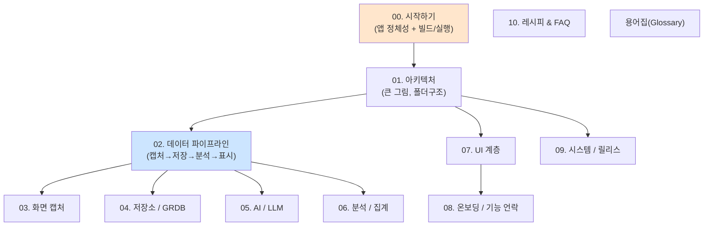

# Dayflow 인수인계 문서 (심화 시리즈)

> 이 시리즈는 **Dayflow 코드베이스를 처음 보는 개발자**가 전체 그림부터 세부 모듈까지
> "의식의 흐름대로" 따라 읽으며 이해하도록 만든 문서입니다. 어려운 용어는 처음 나올 때
> 부연설명하고, [용어집](glossary.md)에도 모아두었습니다.

---

## Dayflow가 뭐야? (3문장 요약)

1. **Dayflow**는 macOS 전용 "자동 워크 저널"입니다. 내가 Mac에서 한 일을 자동으로 기록해 시간대별 타임라인으로 보여줍니다.
2. 동작 원리: **화면을 주기적으로 스크린샷으로 캡처 → 로컬 DB(SQLite)에 저장 → AI(LLM)가 분석해서 "무슨 일을 했는지" 카드로 변환 → 타임라인/일일/주간/채팅 화면으로 표시**.
3. 철학은 **프라이버시 우선(local-first)**: 모든 녹화·분석 데이터는 내 Mac(`~/Library/Application Support/Dayflow/`)에만 저장되고, AI도 로컬 모델로 완전히 돌릴 수 있습니다.

---

## 기술 스택 한눈에

| 항목 | 내용 |
|------|------|
| 플랫폼 | macOS 14.0+ (일부 기능 15.1+) |
| 언어/UI | Swift + SwiftUI + AppKit |
| 화면 캡처 | ScreenCaptureKit (`SCScreenshotManager`) |
| 데이터베이스 | GRDB (SQLite ORM), WAL 모드 |
| AI/LLM | Gemini · Dayflow Backend · Ollama · Chat CLI (4종 + Gemma 폴백) |
| 자동 업데이트 | Sparkle (appcast.xml, EdDSA 서명) |
| 분석/모니터링 | PostHog(분석) + Sentry(크래시) |
| 현재 버전 | v1.14.0 (build 112) |

---

## 읽는 순서

**추천**: 00 → 01 → 02를 먼저 읽으면 전체가 머리에 잡힙니다. 그다음 본인 업무에 맞는 세부 편으로.

---

## 목차

| # | 문서 | 다루는 것 |
|---|------|-----------|
| 00 | [시작하기](00-getting-started.md) | 앱 정체성, 데이터 저장 위치, **로컬 빌드/실행 가이드**, 권한·API키 셋업 |
| 01 | [아키텍처 큰 그림](01-architecture.md) | 레이어 구조, 폴더 트리, 모듈 의존성, 싱글톤 |
| 02 | [데이터 파이프라인](02-data-pipeline.md) | "데이터 한 조각의 일생" — 캡처→저장→분석→표시 end-to-end |
| 03 | [화면 캡처](03-recording-capture.md) | ScreenCaptureKit, 스크린샷 타이머, 상태머신, 프라이버시 필터 |
| 04 | [저장소 / GRDB](04-storage-grdb.md) | GRDB·WAL, 테이블 스키마, 마이그레이션, StorageManager 확장 |
| 05 | [AI / LLM](05-ai-llm.md) | LLMService, 4개 provider, 프롬프트, `processBatch` 6단계 |
| 06 | [분석 / 집계](06-analysis-aggregation.md) | AnalysisManager 스케줄러, 배치 생성, 주간/일일 집계 |
| 07 | [UI 계층](07-ui-layer.md) | View 트리, 7개 탭, MainView/Layout, 사용자 여정 |
| 08 | [온보딩 / 기능 언락](08-onboarding-access.md) | 11단계 온보딩, 시간기반 언락(5/10/30h), Dayflow Pro |
| 09 | [시스템 / 릴리스](09-system-release.md) | 상태바, 권한, 분석, Sparkle 업데이트, 릴리스 스크립트 |
| 10 | [레시피 & FAQ](10-recipes-faq.md) | 자주 하는 작업 how-to + 트러블슈팅 |
| 11 | [다국어 / 한글](11-localization.md) | String Catalog 기반 i18n, 한글 추가·확장 방법 |
| — | [용어집](glossary.md) | 주니어용 핵심 용어 풀이 |

---

## 독자별 추천 경로

- **UI만 손볼 사람**: 00 → 01 → 07 → 08 → 10
- **분석 파이프라인 만질 사람**: 00 → 01 → 02 → 03 → 04 → 05 → 06
- **릴리스/배포 담당**: 00 → 01 → 09 → 10

> 코드 참조는 `[파일명](경로#Lxx)` 형식으로 클릭 가능합니다. 줄 번호는 작성 시점 기준이며
> 코드가 바뀌면 다를 수 있으니 심볼 이름으로도 검색하세요.
